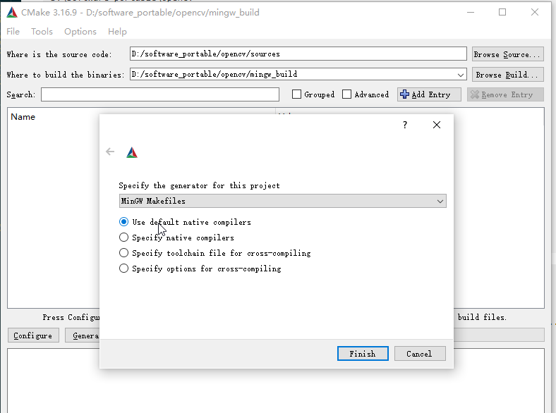
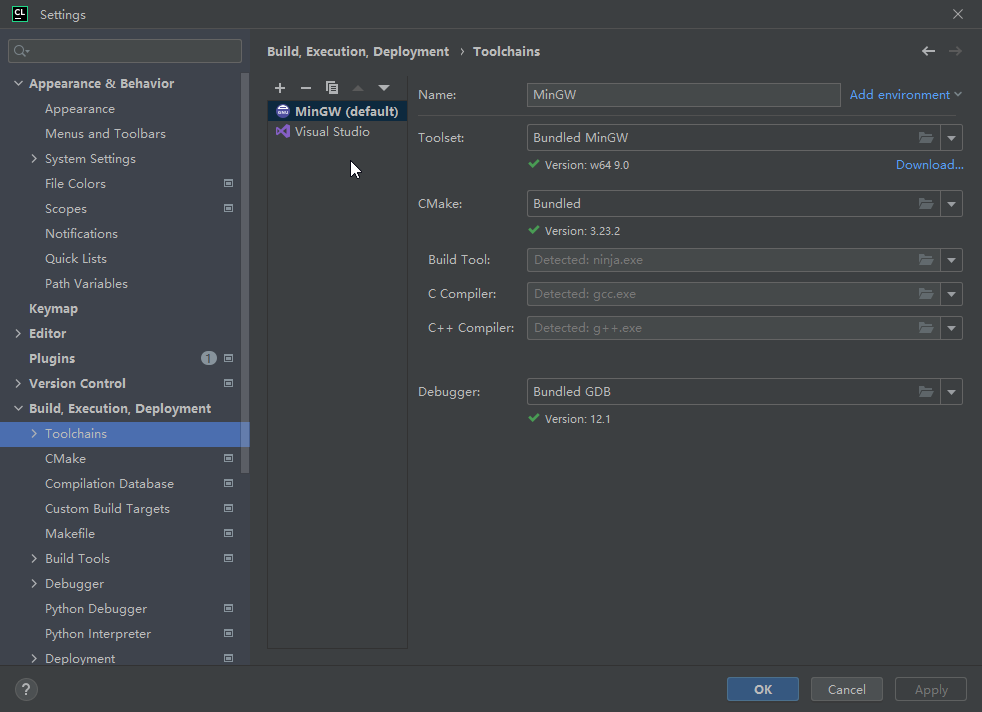

[TOC]

# 概述

本文主要介绍如何在Windows系统下使用Jetbrains系列编译器CLion配合MSYS2编译器调用opencv实现图片、视频、摄像头的读取与显示。

# 环境

## 预装环境

- Windows 10
- CLion 2022
- CMake 3.16.9

## 安装CMake

下载地址：[cmake-3.16.9-win64-x64.msi](https://cmake.org/download/

## 安装MSYS2

下载地址：[msys2-x86_64-20230718.exe](https://github.com/msys2/msys2-installer/releases/download/2023-07-18/msys2-x86_64-20230718.exe)，安装路径选择`D:\software_installation`，安装完成后，打开`MSYS2`终端，执行如下命令更新`pacman`包管理器：

```bash
pacman -S mingw-w64-ucrt-x86_64-gcc
pacman -S mingw-w64-ucrt-x86_64-gdb
pacman -S mingw-w64-ucrt-x86_64-make
pacman -S mingw-w64-ucrt-x86_64-cmake
```

配置路径`D:\software_installation\msys64\mingw64\bin`添加到系统环境变量`Path`中。

# 编译opencv

## 1.下载源码
本文档使用的是opencv4.5.4版本，下载地址：[opencv-4.5.4](https://github.com/opencv/opencv/releases/download/4.5.4/opencv-4.5.4-vc14_vc15.exe)，[opencv_contrib-4.5.4](https://github.com/opencv/opencv_contrib/archive/refs/tags/4.5.4.zip)

`exe`文件双击打开，选择解压路径，点击解压即可。zip文件解压到opencv目录下一级即可，本例中解压路径为：`D:\software_portable\opencv`,解压后的文件夹如下所示：

```text
D:\software_portable\opencv
├─build
│  ├─bin
│  ├─etc
│  ├─include
│  │  └─opencv2
│  ├─java
│  ├─python
│  ├─x64
│  │  ├─vc14
│  │  └─vc15
│  ├─OpenCVConfig.cmake
│  ├─OpenCVConfig-version.cmake
│  ├─setup_vars_opencv4.cmd
├─opencv_contrib-4.5.4
│  ├─doc
│  ├─modules
│  ├─samples
├─sources
```

> 注: 为避免因网络问题导致编译过程中第三方依赖下载失败，这里需要修改一下下载地址:
>
> 在`raw.githubusercontent.com`的前面加上一个代理: `https://ghproxy.com/`
> 看起来像这样的 `https://ghproxy.com/https://raw.githubusercontent.com/opencv/opencv_3rdparty/.../ippicv/`
> 
> 这里把`RootDir`定义为`D:\software_portable\opencv\sources`
> **需要修改的文件** : 
> 1. `${RootDir}/3rdparty/ffmpeg/ffmpeg.cmake`
> 2. `${RootDir}\opencv\sources\3rdparty\ippicv\ippicv.cmake`

## 2.CMake配置

1. 启动`cmake-gui`，在`Where is the source code`中填写`D:\software_portable\opencv\sources`，在`Where to build the binaries`中填写`D:\software_portable\opencv\mingw_build`，点击`Configure`，选择`MSYS Makefiles`，点击`Finish`，如下图所示：

    

2. 配置项`OPENCV_EXTRA_MODULES_PATH`填写`D:\software_portable\opencv\opencv_contrib-4.5.4\modules`，勾选配置项`OPENCV_ENABLE_NONFRFEE`,点击`Configure`

3. 取消勾选所有`PYTHON`相关的配置项，取消勾选所有`test`相关的配置项，点击`Configure`

4. 取消勾选`BUILD_opencv_face`，`BUILD_opencv_wechat_qrcode`,`BUILD_opencv_xfeatures2d` 点击`Configure`

5. 勾选`BUILD_opencv_world`，点击`Configure`

6. 点击`Generate`

## 3.mingw编译

使用终端进入`D:\software_portable\opencv\mingw_build`目录，执行如下命令：

```bash
mingw32-make -j8
mingw32-make install
```

> 注: 如果遇到编译报错，可取消勾选`ADE`选项，再重新执行一次即可。

编译完成后，将`D:\software_portable\opencv\mingw_build\install\x64\mingw\bin`添加到系统环境变量`Path`中。

# 项目配置

## 新建项目
启动CLion，新建一个项目，点击settings选择`Build,Execution,Deployment`-->`Toolchain`,选择`MINGW`如下图所示：




## 配置CMakelists.txt

```cmake
cmake_minimum_required(VERSION 3.23)
project(test)

set(CMAKE_CXX_STANDARD 11)
set(OpenCV_DIR D:/software_portable/opencv/mingw_build/install)

find_package(OpenCV REQUIRED)

include_directories(${OpenCV_INCLUDE_DIRS})

# 设置源文件
set(SOURCES main.cpp)
add_executable(test ${SOURCES})

target_link_libraries(test ${OpenCV_LIBS})
```

> 注：此处的`project(test)`与工程名必须相同,`OpenCV_DIR`的地址是编译安装后的地址，即`OpenCVConfig.cmake`所在的目录。

> 注：配置完成后需要重启系统，否则可能会出现程序无法运行的情况。


# 代码实现

## 图片读取与显示

```c++
#include <iostream>
#include <opencv2/opencv.hpp>

using namespace std;
using namespace cv;

int main()
{
    Mat img = imread("D:\\software_portable\\opencv\\sources\\samples\\data\\lena.jpg");
    if (img.empty())
    {
        cout << "read image failed!" << endl;
        return -1;
    }
    imshow("lena", img);
    waitKey(0);
    return 0;
}
```

## 视频读取与显示

```c++
#include <iostream>
#include <opencv2/opencv.hpp>

using namespace std;
using namespace cv;

int main()
{   
    // change to your video path
    VideoCapture cap("G:\\2.mp4");
    if (!cap.isOpened())
    {
        cout << "open video failed!" << endl;
        return -1;
    }
    Mat frame;
    while (true)
    {
        cap >> frame;
        if (frame.empty())
        {
            cout << "read frame failed!" << endl;
            break;
        }
        imshow("video", frame);
        if (waitKey(10) == 27)
        {
            break;
        }
       
    }
    return 0;
}
```

## 摄像头读取与显示

```c++
#include <iostream>
#include <opencv2/opencv.hpp>

using namespace std;
using namespace cv;

int main()
{
    VideoCapture cap(1);
    if (!cap.isOpened())
    {
        cout << "open camera failed!" << endl;
        return -1;
    }
    Mat frame;
    while (true)
    {
        cap >> frame;
        if (frame.empty())
        {
            cout << "read frame failed!" << endl;
            break;
        }
        imshow("camera", frame);
        if (waitKey(10) == 27)
        {
            break;
        }

    }
    return 0;
}
```
将上述代码保存为main.cpp，点击"生成"->"生成解决方案"，编译成功后，点击"调试"->"开始执行调试"，即可看到效果。

