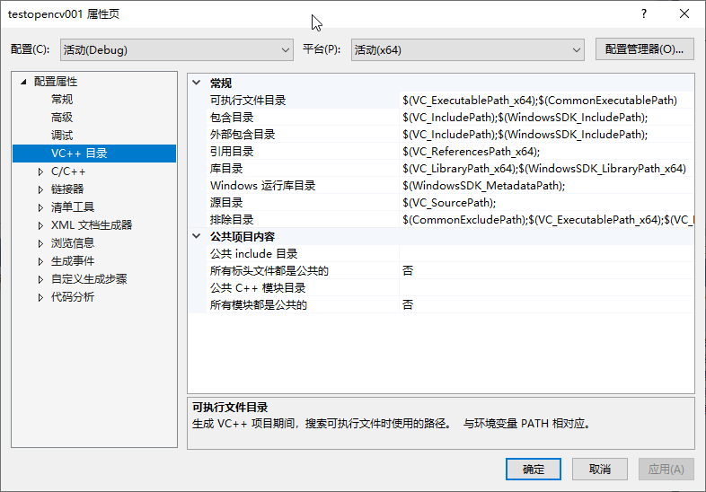
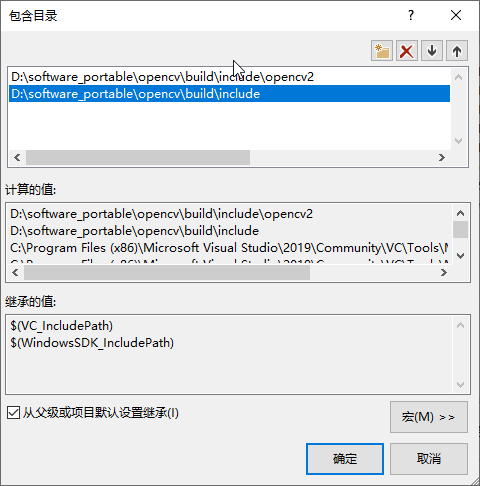
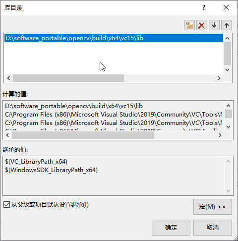
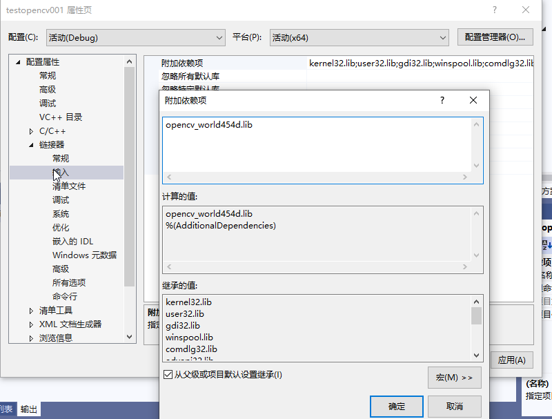

[TOC]

# 概述

本文主要介绍如何在Windows系统下使用VS2019+C++调用opencv实现图片、视频、摄像头的读取与显示。

# 环境

## 预装环境
- Windows 10
- VS2019

## 安装opencv

本文档使用的是opencv4.5.4版本，下载地址：[opencv-4.5.4](https://github.com/opencv/opencv/releases/download/4.5.4/opencv-4.5.4-vc14_vc15.exe)

双击打开，选择解压路径，点击解压即可。本例中解压路径为：`D:\software_portable\opencv`,解压后的文件夹如下所示：

```text
D:\software_portable\opencv
├─build
│  ├─bin
│  ├─etc
│  ├─include
│  │  └─opencv2
│  ├─java
│  ├─python
│  ├─x64
│  │  ├─vc14
│  │  └─vc15
│  ├─OpenCVConfig.cmake
│  ├─OpenCVConfig-version.cmake
│  ├─setup_vars_opencv4.cmd
├─sources
```

配置环境变量,将`D:\software_portable\opencv\build\x64\vc15\bin`添加到系统环境变量`Path`中。

# 项目配置


## 新建项目
启动VS2019，新建一个空项目，修改项目属性为`Debug` `x64`，在解决方案资源管理器窗口点击源代码文件夹，创建一个main.cpp源文件，如下图所示：


## 配置opencv

右击解决方案选择属性，选择`VC++目录`，在`包含目录`中添加`D:\software_portable\opencv\build\include`和`D:\software_portable\opencv\build\include\opencv2`，在`库目录`中添加`D:\software_portable\opencv\build\x64\vc15\lib`，如下图所示：


 


在`链接器`中选择`输入`，在`附加依赖项`中添加`opencv_world454d.lib`，如下图所示：




> 注：此处的`opencv_world454d.lib`,文件位置是`D:\software_portable\opencv\build\x64\vc15\lib`，如果你的opencv版本不是4.5.4，那么你需要修改为你的版本号。此外， 如果你的项目是release版本，那么你需要修改为`opencv_world454.lib`。


# 代码实现

## 图片读取与显示

```c++
#include <iostream>
#include <opencv2/opencv.hpp>

using namespace std;
using namespace cv;

int main()
{
    Mat img = imread("D:\\software_portable\\opencv\\sources\\samples\\data\\lena.jpg");
    if (img.empty())
    {
        cout << "read image failed!" << endl;
        return -1;
    }
    imshow("lena", img);
    waitKey(0);
    return 0;
}
```

## 视频读取与显示

```c++
#include <iostream>
#include <opencv2/opencv.hpp>

using namespace std;
using namespace cv;

int main()
{   
    // change to your video path
    VideoCapture cap("G:\\2.mp4");
    if (!cap.isOpened())
    {
        cout << "open video failed!" << endl;
        return -1;
    }
    Mat frame;
    while (true)
    {
        cap >> frame;
        if (frame.empty())
        {
            cout << "read frame failed!" << endl;
            break;
        }
        imshow("video", frame);
        if (waitKey(10) == 27)
        {
            break;
        }
       
    }
    return 0;
}
```

## 摄像头读取与显示

```c++
#include <iostream>
#include <opencv2/opencv.hpp>

using namespace std;
using namespace cv;

int main()
{
    VideoCapture cap(1);
    if (!cap.isOpened())
    {
        cout << "open camera failed!" << endl;
        return -1;
    }
    Mat frame;
    while (true)
    {
        cap >> frame;
        if (frame.empty())
        {
            cout << "read frame failed!" << endl;
            break;
        }
        imshow("camera", frame);
        if (waitKey(10) == 27)
        {
            break;
        }

    }
    return 0;
}
```
将上述代码保存为main.cpp，点击"生成"->"生成解决方案"，编译成功后，点击"调试"->"开始执行调试"，即可看到效果。

