[TOC]

# 概述

本文档主要描述在`Windows`平台下，使用源码编译`opencv 4.5.4`版本，支持`opencv_contrib`和`CUDA`加速的过程。

主要步骤如下：

**1. 源码下载**
**2. CMake编译与配置**
**3. Visual Studio编译**

# 源码下载

访问`opencv`和`opencv_contrib`官方开源地址：[opencv](https://github.com/opencv/opencv) 、[opencv_contrib](https://github.com/opencv/opencv_contrib),按照`Tag`选择`4.5.4`版本，下载`opencv`和`opencv_contrib`源码。

- `opencv`源码: [opencv-4.5.4-vc14_vc15.exe](https://github.com/opencv/opencv/releases/download/4.5.4/opencv-4.5.4-vc14_vc15.exe)
- `opencv_contrib`源码: [opencv_contrib-4.5.4.zip](https://github.com/opencv/opencv_contrib/archive/refs/tags/4.5.4.zip)

> 注：`opencv`和`opencv_contrib`版本必须一致，否则编译过程中会出现各种问题,下载源码时，请注意选择同样的`Tag`版本，本例中选择的是`4.5.4`版本

> 注: opencv-4.5.4-vc14_vc15.exe是opencv的windows安装包，解压后得到opencv-4.5.4文件夹，其中包含opencv的源码和cmake编译好的文件，下载源码时需留意，如图所示
> 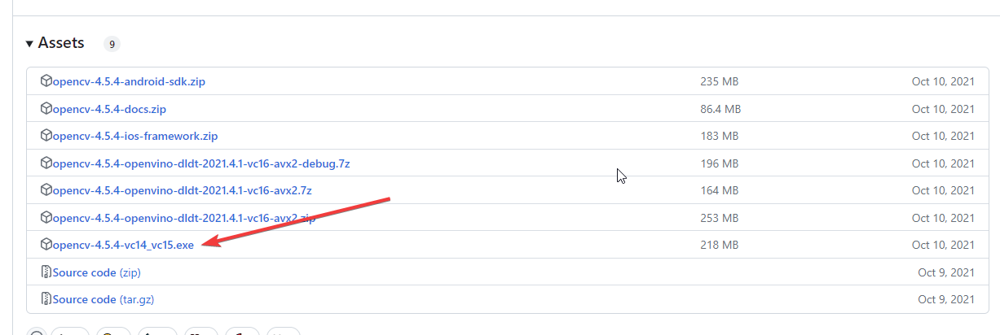

# CMake编译与配置

## 软件下载

> 注: 本例中使用的是`Visual Studio Community 2019`已经完成安装

下载`CMake 3.16.6`版本，[下载地址](https://cmake.org/files/v3.16/cmake-3.16.6-win64-x64.msi),下载完成后，双击安装，**安装过程中选择`Add CMake to the system PATH for all users`**，然后一路`next`即可。

> 注: 不建议下载`CMake`最新版本，最新版本的`CMake`在选择编译器时，可能没有`VS 2019`选项导致无法编译。

> 注: 如果因为系统安装的`Visual Studio`版本不同，如安装的是`VS 2017`或`VS 2015`而需要选择另外一个`CMake`版本，可在此[下载地址](https://cmake.org/files/)选择合适的版本


## 其他环境准备

### NVIDIA驱动

访问[NVIDIA驱动下载](https://www.nvidia.cn/Download/index.aspx?lang=cn)页面，选择合适的驱动版本，下载安装即可。

### CUDA和cuDnn

访问[NVIDIA CUDA下载](https://developer.nvidia.com/cuda-downloads)页面，选择适当的驱动和CUDA版本以及对应版本的cudnn，安装win10环境。本示例使用的CUDA版本为`10.2`，cuDnn版本为`7.6.5`。

> 注: CUDA版本的选择需要根据显卡型号和驱动版本来确定，这里不在赘述，此处提供一个显卡架构与算力的对应关系表，后续编译配置时会用到。如图所示: 
> 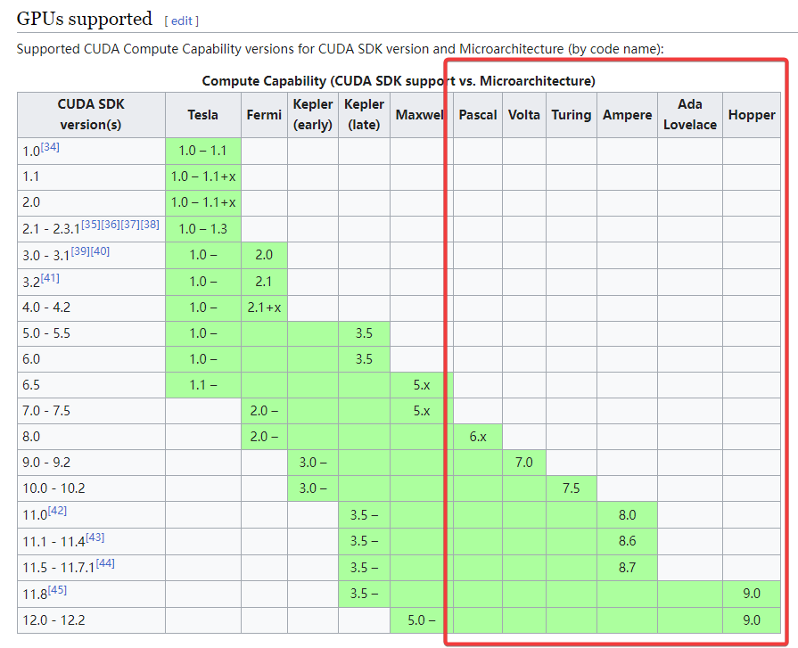


### 解压文件，准备就绪

解压下载的源码文件`opencv-4.5.4-vc14_vc15.exe`和`opencv_contrib-4.5.4.zip`到同级目录，本例中，两份源码文件夹均解压到`E:\python\python_src_env`目录下，解压完成后，目录结构如下：

```
E:\python\python_src_env
├─opencv
│  ├─build
│  ├─sources
│  └─README.md.txt
└─opencv_contrib-4.5.4
	├─doc
	├─modules
	└─samples
```

## CMake 编译

### 1. 加载源码，第一次configure

1. 打开`cmake-gui`软件，如图所示：
   

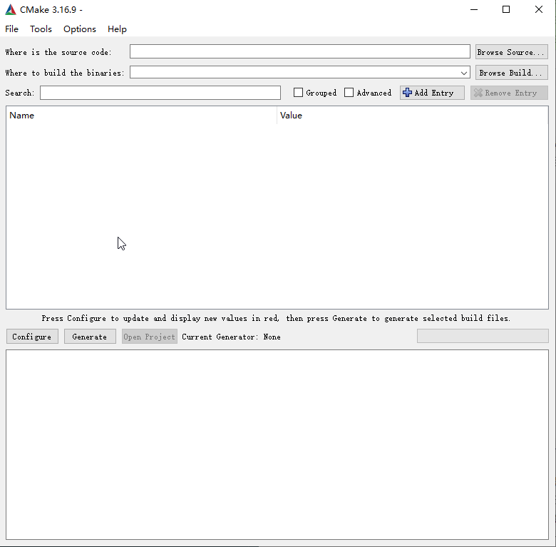

2. 加载源码文件夹(`where is the source code`)和build文件夹(`where to build the binaries`)，点击`Browse Source...`按钮，选择`opencv`源码文件夹，如图所示：
   
   > 注: 这里说明一下，由于下载的源码文件夹中原本已经有编译好的build文件夹，所以我们在同级目录中新建一个`cudabuild`文件夹，用于编译支持CUDA的opencv，如图所示：

   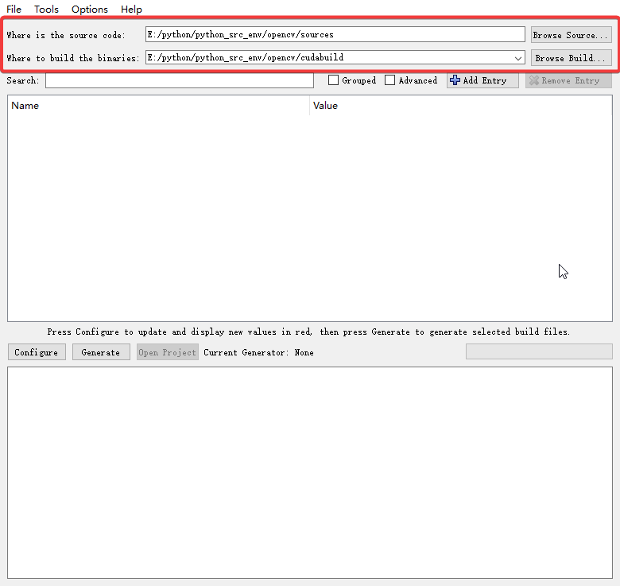
   
3. 第一次点击 `configure`, 选择`vs 2019`和`x64`架构，点击`finish`，开始第一次编译，如图所示：
   
5. 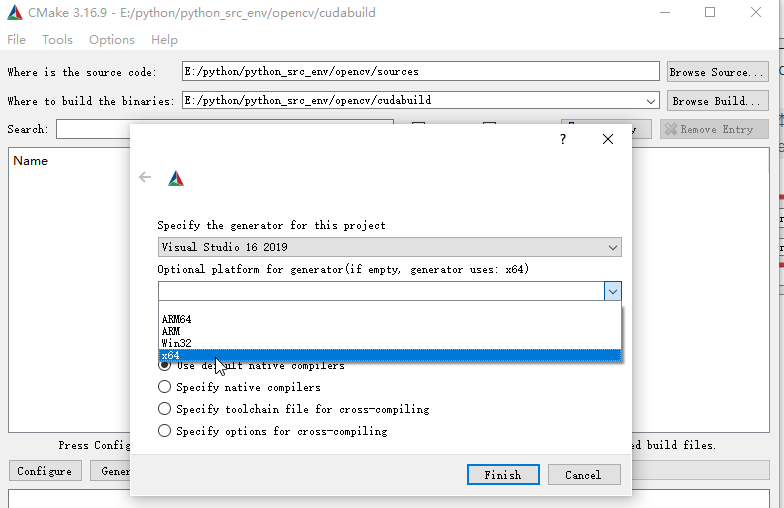

### 2. 手动下载第三方依赖，第二次configure

第一次编译完成后，日志中出现红色报错，会导致编译失败，出现这种现象的原因是`CMake`编译时需要下载第三方依赖，由于网络问题导致下载失败后报错，此时需要手动下载依赖，然后将依赖文件放到指定位置，再次编译即可。

手动下载第三方`ffmpeg`和`ippicv`依赖文件，方法如下：


> 注: 为节省篇幅，源码存放地址`E:\python\python_src_env`后面会以`${RootDir}`简称。


> 注: 另一种方法，可通过添加代理头的方式直接下载:
>
> 在`raw.githubusercontent.com`的前面加上一个代理: `https://ghproxy.com/`
>
> 看起来像这样的 `https://ghproxy.com/https://raw.githubusercontent.com/opencv/opencv_3rdparty/.../ippicv/`
>
> **需要修改的文件** : `${RootDir}/3rdparty/ffmpeg/ffmpeg.cmake`  和 `${RootDir}\opencv\sources\3rdparty\ippicv\ippicv.cmake`


1. 进入`${RootDir}\opencv\sources\3rdparty\ffmpeg`文件夹，使用文本编辑器打开`ffmpeg.cmake`文件，根据脚本文件指定的下载代码，手动拼接文件的下载链接，使用**更科学的方式**下载文件，如图所示，将`${FFMPEG_BINARIES_COMMIT}`替换为原值字符串，将文件名拼接到链接最后：
   
   
   
   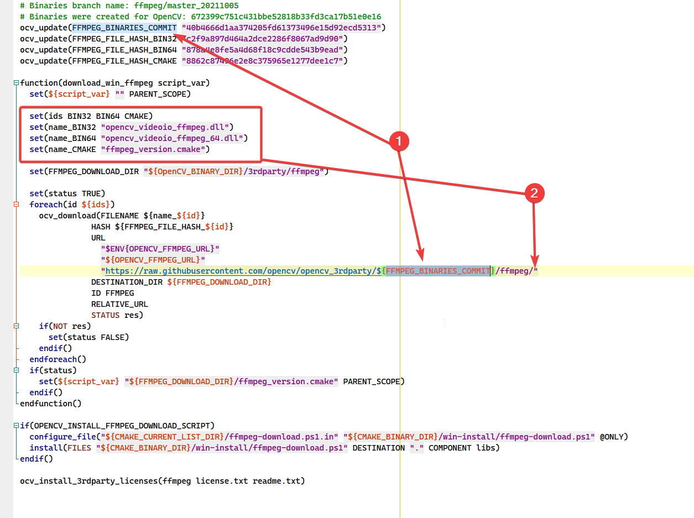
   
2. 举例说明：下载`opencv_video_ffmpeg.dll`文件，则链接拼接为
   ```
   https://raw.githubusercontent.com/opencv/opencv_3rdparty/40b4666d1aa374205fd61373496e15d92ecd5313/ffmpeg/opencv_video_ffmpeg.dll
   ```
   点击链接下载文件即可，其他两个文件采用同样的方式下载。

3. 上述三个文件下载完成后，需要将文件重命名到指定的文件名，存放到`${RootDir}\opencv\sources\.cache\ffmpeg`文件夹中，没有则手动创建，文件名命名规则为`${hashcode}-原文件名`，文件名对应的`hashcode`,见`ffmpeg.cmake`文件中的`FFMPEG_FILE_HASH_xxx`字段，文件重命名如图所示：
   
   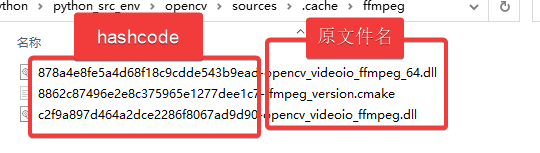

4. 下载`ippicv`文件，进入`${RootDir}\opencv\sources\3rdparty\ippicv\`文件夹，使用文本编辑器打开`ippicv.cmake`文件，根据脚本文件指定的下载代码，手动拼接文件的下载链接，使用**更科学的方式**下载文件，如图所示，将`${IPPICV_BINARIES_COMMIT}`替换为原值字符串，将文件名拼接到链接最后：
   
   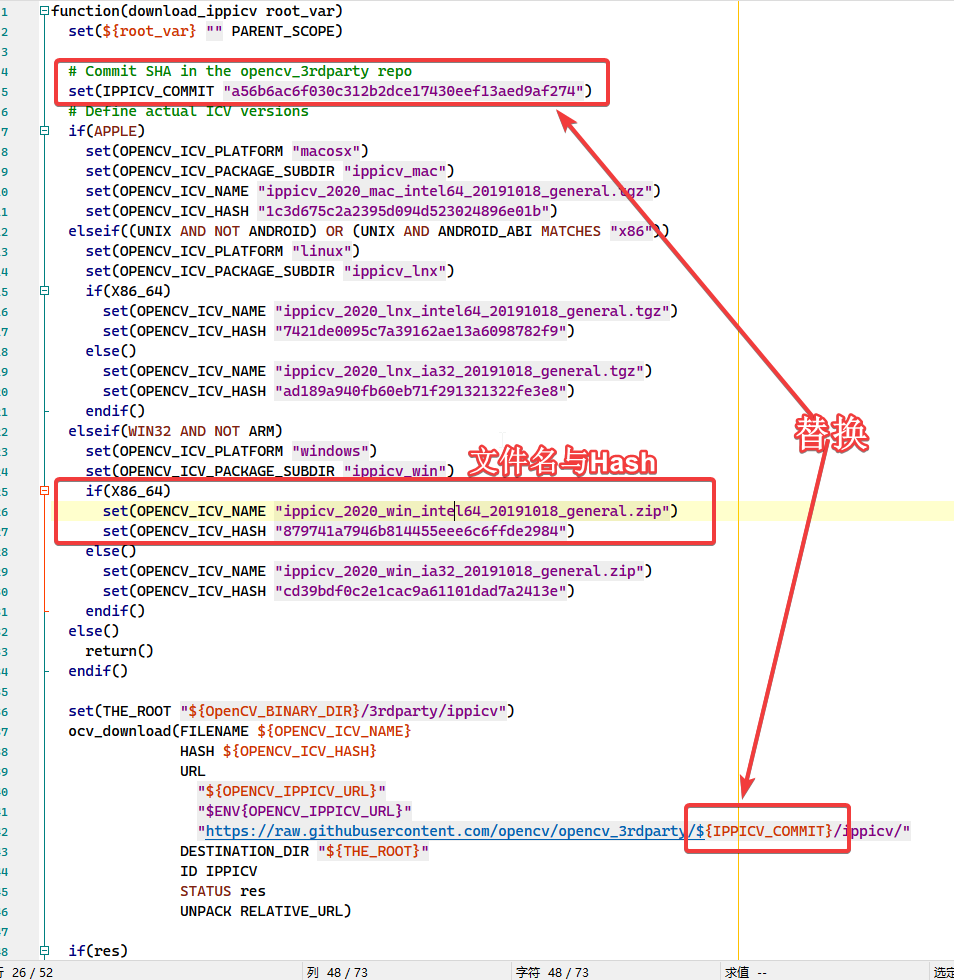

5. 举例说明：下载`ippicv_2020_win_intel64_20191018_general.zip`文件，则链接拼接为
   ```
   https://raw.githubusercontent.com/opencv/opencv_3rdparty/a56b6ac6f030c312b2dce17430eef13aed9af274/ippicv/ippicv_2020_win_intel64_20191018_general.zip
   ```

   文件重命名为: `879741a7946b814455eee6c6ffde2984-ippicv_2020_win_intel64_20191018_general.zip`,存放到`${RootDir}\opencv\sources\.cache\ippicv`文件夹中，没有则手动创建。

下载完成后，再次点击`configure`,等待`configure`完成。


### 3. 修改Python3相关变量，第三次configure(此步选做)

`Python`环境中使用`opencv-python`库使用`opencv`相关的功能时，需要在编译之前，指定`Python`的环境目录，否则会导致编译完成后，`Python`环境中的`opencv-python`库无法使用`opencv`相关的功能。


1. 创建虚拟环境，建议使用`anaconda`,并在虚拟环境中安装numpy(编译时需要),执行此步骤是为了将`CUDA版本`的opencv安装到`虚拟环境`中，`只安装到宿主机环境不需要执行此步骤`
   ```
	conda create -n opencv python=3.10 -y
	conda activate opencv
	pip install numpy==1.20.1
	```

	> ​	注: python虚拟环境的版本需要与宿主机安装的Python解释器版本相同，否则编译安装完成后会导致import失败.


2. 更换一下几个变量，分别将路径指向虚拟环境的对应位置 : 
   - `PYTHON3_EXECUTABLE`
   - `PYTHON3_INCLUDE_DIR`
   - `PYTHON3_LIBRARY`、
   - `PYTHON3_NUMPY_INCLUDE_DIRS`
   - `PYTHON3_PACKAGES_PATH`,
   - 如图所示：
   - 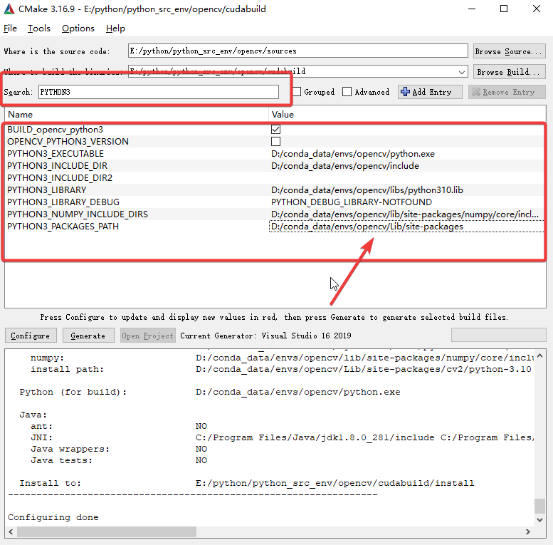
3. 点击`configure`，等待`configure`完成后，第一次点击`generate`。等待`generate`完成。

### 4. 添加opencv_contrib模块

1. search框搜`OPENCV_E`，在`OPENCV_EXTRA_MODULES_RATH`一项，添加`opencv_contrib-4.5.4`中的`modules`目录
2. search框搜`OPENCV_E`，把`OPENCV_ENABLE_NONFREE`打勾，如图所示：
3. 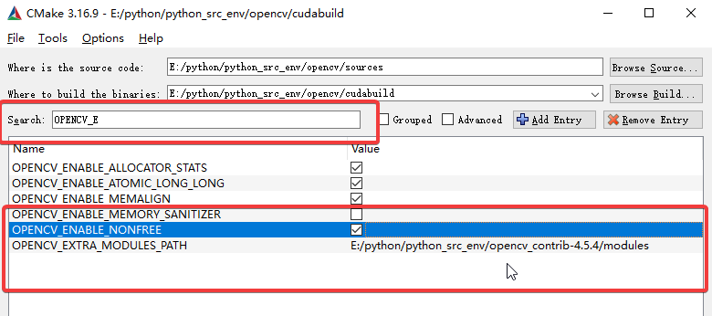

### 5. 添加CUDA支持

1. search框搜`CU`，勾选三个配置 : `WITH_CUDA`、`OPENCV_DNN_CUDA`、`BUILD_CUDA_STUBS`，如图所示：
2. 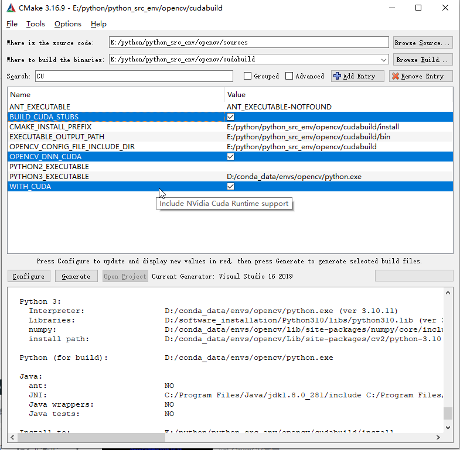
2. search框搜`FAST` 勾选`ENABLE_FAST_MATH`

### 5. 取消test模块的编译

1. search框搜`test`，将所有的含`test`选项取消勾选，如图所示：
   
   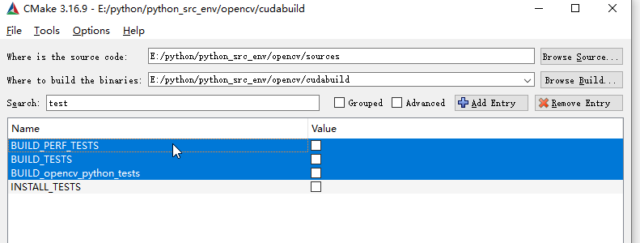


2. Search框搜`world`，将`build_opencv_world`打勾，将所有opencv的库都编译在一起不需要自己一一添加每个小模块。

第二次点击`generate`，等待`generate`完成。耗时较长。

### 6. 取消wechat_qrcode、face、xfeatures2d模块的编译

取消勾选`BUILD-opencv_face`和`BUILD-opencv_wechat_qrcode`、`BUILD_opencv_xfeatures2d` 

### 6. 支持CUDA_FAST_MATH

1.    搜索框输入`cuda`，勾选`CUDA_FAST_MATH `，
   
   > 注: 关于显卡算力等级的适配,默认情况下适配当前所有的算力等级，想要修改的话，搜索`CUDA_ARCH_BIN`字段，将显卡的算力改成自己显卡的算力，对应算力与显卡型号如第一章图片所示，如，显卡型号为 `RTX 2060 Super`所对应的算力为`7.5`，则删除其他的算力版本，仅保留`7.5`即可

2. 第三次点击`generate`，等待`generate`完成。


## VS 编译

上述CMake Generate完成后，直接点击`Open Project`,会启动VS2019打开工程项目，如图所示：

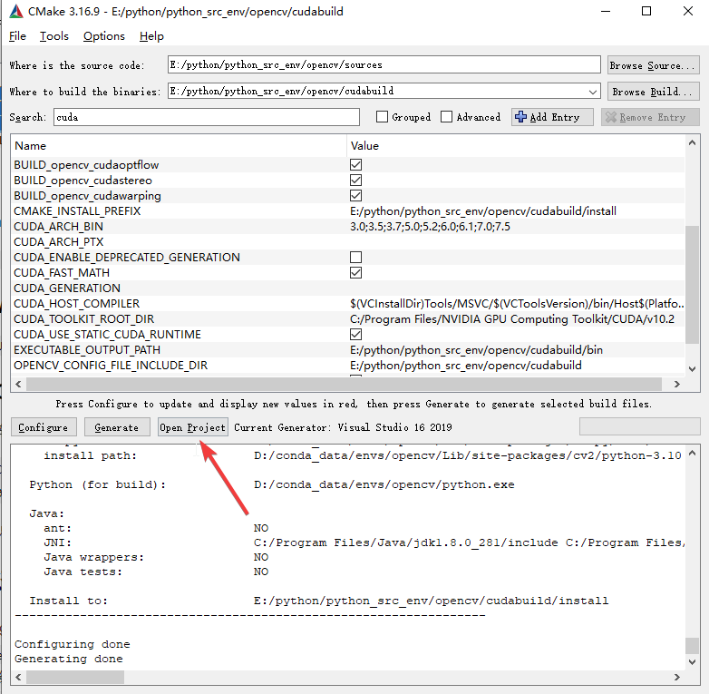

 > 注：另一种打开方式: `${RootDir}\opencv\build`文件夹下会生成`OpenCV.sln`文件，使用VS2019打开即可

1. VS2019打开刚刚编译工程后，会反应一段时间，一定要等待左下角显示的项全部加载完毕才可以继续操作
2. 选择`Release` `x64`，接着找到`CmakeTargets`下的`ALL_BUILD`，右键→“生成”，然后开始漫长的等待…… 如图所示：
2. 
   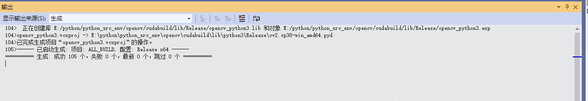


3. 编译完成后，`解决方案资源管理器`—>`CMakeTargets`—>`INSTALL`—>`生成`”然后又是等，好在这次时间很短。如图所示：

4. 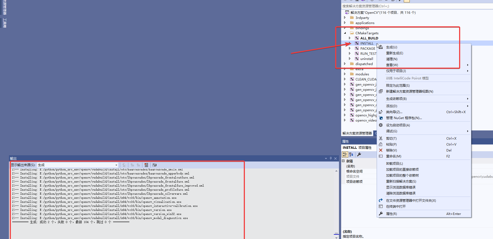

   

5. 此时`opencv_cuda\build\lib\python3\Release`文件夹下可以看到`cv2.cp310-win_amd64.pyd`文件(不同的python版本，名称会略有差异)


4. 同时，在虚拟环境或者宿主机环境中，可以在路径`Lib\site-packages`下看到`cv2`文件夹


 ## 验证opencv环境
 使用命令行进入python环境,执行一下代码即可验证:
 ```
 c:\users\administrator> python
 >>> import cv2
 >>> cv2.cuda.getCudaEnabledDeviceCount()
 1 # 得到GPU设备数量，即表示opencv的GPU版本已经安装成功
 ```


欢迎使用 **{小书匠}(xiaoshujiang)编辑器**，您可以通过 `小书匠主按钮>模板` 里的模板管理来改变新建文章的内容。