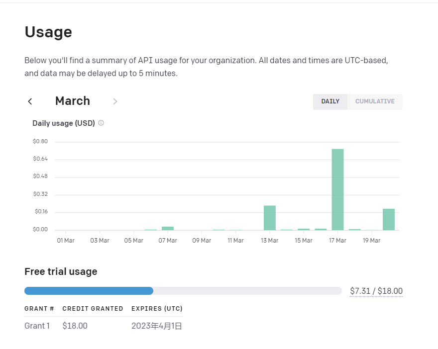
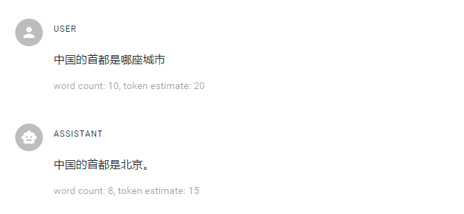
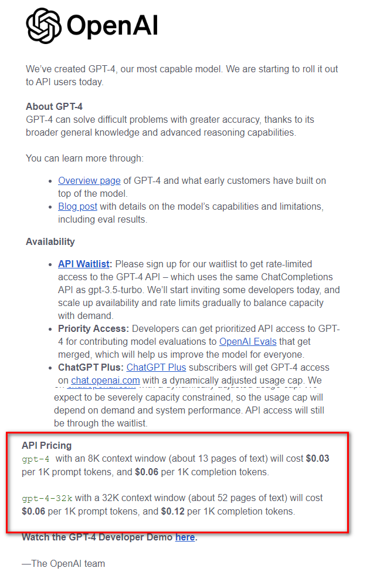
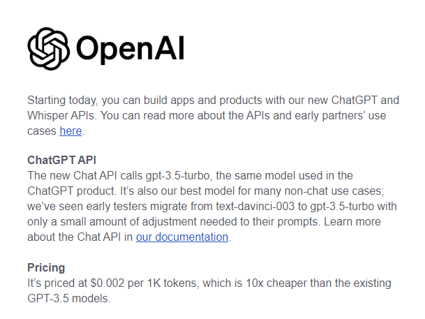
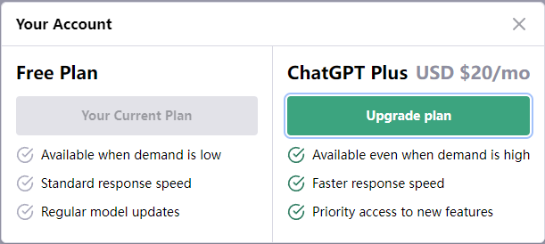
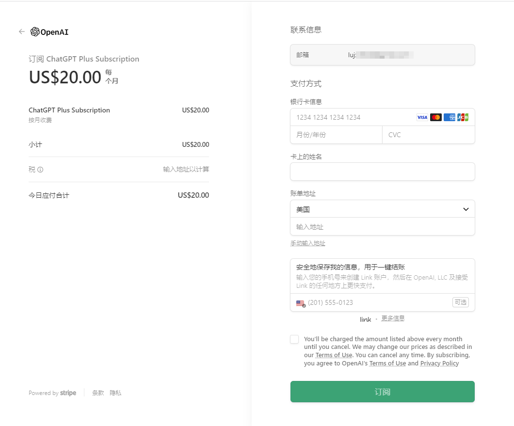
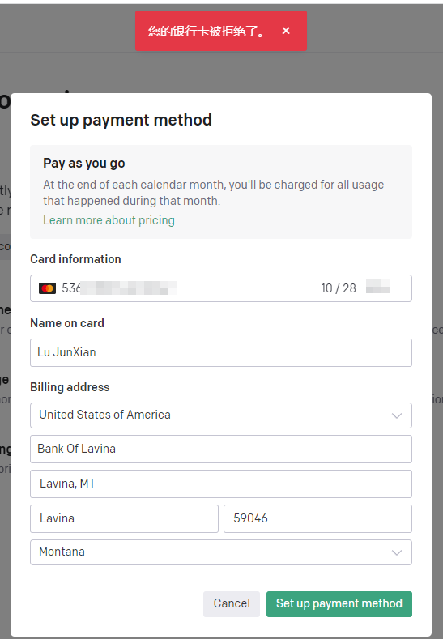

# 当前账号情况
当前`ChatGPT`账号是在官网申请的个人免费账号，仅限于官方`Web`页面进行`ChatGPT`的问答与交互。

如果需要使用第三方工具，如`nodejs`或`python`,访问`ChatGPT`的官方`API`需要在程序中获取官方`API Key`的授权方可使用。

新创建的账号，官方免费赠送了一定时效和一定调用量的`API Key`授权，分别是`18$`的用量和`一个月`的授权时效,如下图所示，已用额度`7.31$`,授权时效至`2023年4月1日`到期

# API的价格

## 初始价格
`ChatGPT`的API授权价格有过调整，初始接入API的价格为`0.02$/1k token`

> 注：这个token的长度和问题的长度并非同一概念，不同语言的字数与token的转换关系不一样，以中文为例，以下问题和回复的长度和token值程度如下所示：
> 
> 问题的长度为10个汉字，使用了20 token，回复的汉字长度为，占用15 token

## 降价

3月上旬`OpenAI`官方更新了新的`ChatGPT`模型，同时，将`API`的调用价格下调了`十倍`，即现有的`GPT-3.5`的`API`调用价格为`0.002$/1k token`

同时，3月下旬，`GPT-4`模型发布,同时也公布了其`API`的价格,如下表所示

> 注：
> 1. GPT-4模型截止目前为止(2023年3月20日)只有升级了plus套餐的账号才能使用
> 2. GPT-4模型暂未开放API访问接口，目前只能通过官方页面访问

| 模型 | 价格 | 备注    |
| ---- | ---- | --- |
|  GPT-3.5    |   `0.002$ / 1k token`   |     |
|  GPT-4 8K   |   `$0.03 / 1K prompt tokens, $0.06 per 1K completion tokens`  |   8K表示支持的提问文本的字符长度，约为13页半角字符的文本   |
|    gpt-4-32k | `$0.06 / 1K prompt tokens, $0.12 / 1K completion tokens`     | 32K表示支持的提问文本的字符长度，约为52页半角字符的文本    |

> 注 ：可以注意到GPT-4模型的收费区分提问与回答 ，`prompt tokens`可以理解为提问的问题所使用的额度，`completion tokens`可以理解为输出答案所使用的额度，目前的问答是**双向收费**的。

这里附上价格相关的官方邮件的部分截图：

# 账号升级方法
官方网页上，点击`Upgrade to Plus`，输入信用卡信息后即可完成账号升级，如下图所示：

# 目前存在的问题
以现有的国内的银联卡或主流第三方支付无法完成ChatGPT的官方支付验证，经查询，需要通过外币信用卡，如万事达、运通、JCB、VISA等，而且必须是境外开户的账户才能通过验证，已经尝试过添加境内开户的万事达信用卡，提交信息时被决绝支付，如图所示：

> 该信用卡属于外币信用卡，但是由于是委托中国农业银行进行开户和管理的，无法进行支付ChatGPT升级计划

# 解决方案
通过查阅资料和技术博客，查询到一种叫`虚拟信用卡`的方式，可以完成跨境支付，通过注册虚拟信用卡并将地址设置在国外可完成ChatGPT的升级；

在淘宝网站上，也有一些商家提供信用虚拟卡的服务，需要支付一定的费用，在其商品评论区有人表示使用它的服务完成了ChatGPT的升级。

> 由于存在账号信息、资金安全以及账号停用等风险，没有再继续进行虚拟信用卡的注册与转账等测试。

# 参考链接
[使用虚拟信用卡升级ChatGPT Plus及OpenAI付款设置教程](https://www.vpsdawanjia.com/6149.html)

欢迎使用 **{小书匠}(xiaoshujiang)编辑器**，您可以通过 `小书匠主按钮>模板` 里的模板管理来改变新建文章的内容。