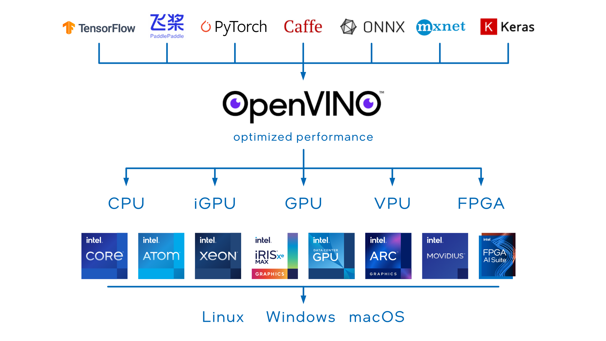
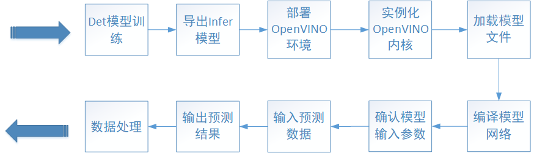
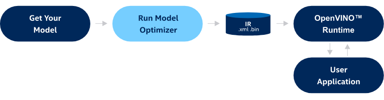
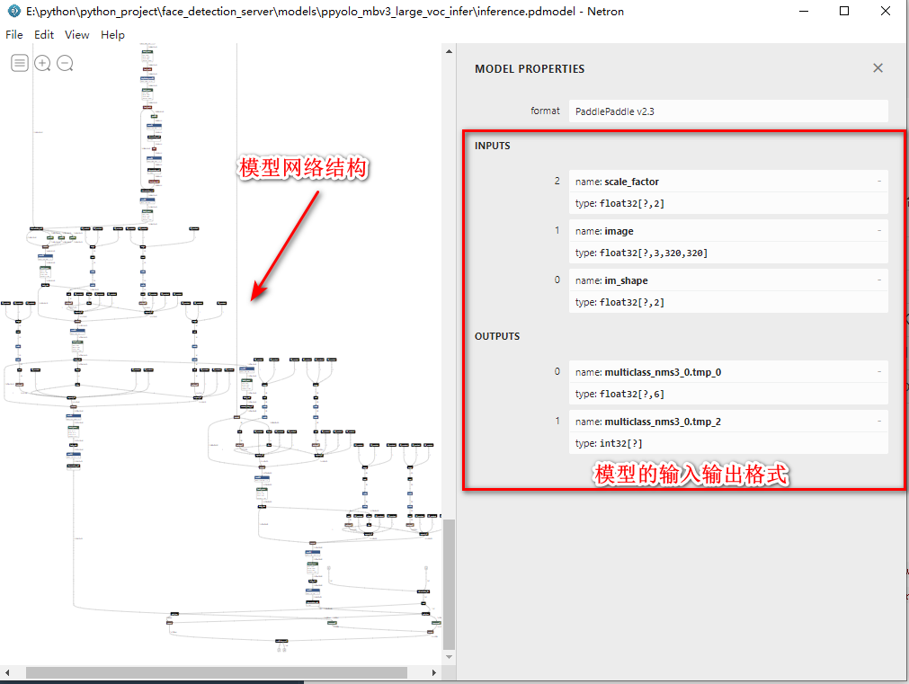

* [概述](#概述)
* [模型推理加速](#模型推理加速)
	* [工作流程](#工作流程)
	* [关于模型文件的格式](#关于模型文件的格式)
	* [OpenVINO环境部署](#openvino环境部署)
	* [OpenVINO推理示例(PaddlePaddle Inference)](#openvino推理示例paddlepaddle-inference)
	* [OpenVINO推理示例(OpenVINO IR)](#openvino推理示例openvino-ir)
	* [性能数据](#性能数据)
* [附录](#附录)
	* [查看模型的输入输出](#查看模型的输入输出)
	* [参考链接](#参考链接)

# 概述
`OpenVINO`自`2022.1`版本更新以来，出现了以下重大变化：

- 拆分了 `OpenVINO Runtime` 和 `OpenVINO Development Tool`
- 添加了对`PaddlePaddle`、`ONNX`框架的支持
- 添加了`PyPI`安装方式



# 模型推理加速

## 工作流程
使用`OpenVINO`进行`PaddleDetection`加速推理的工作流程如下：



## 关于模型文件的格式
`OpenVINO development Tool`提供跨平台的模型转换工具`Model Optimizer`（后文简称 `mo`），可以将其他框架的模型格式转换为`OpenVINO Intermediate Representation` 格式 (后文简称 `IR`格式),如下图所示：



>注: 由于`OpenVINO`自`2022.01`版本后添加了对`PaddlePaddle`框架的支持，使用模型进行加速推理时，也可以选择**不使用**`mo`工具转换模型格式为`IR`.

## OpenVINO环境部署
软硬件依赖于环境如下：
- 操作系统: `Windows 10 x64`
- `python`版本: `python3.7`
- `CPU`型号： `Intel Core i5-12400F`

1. 创建虚拟环境
   ```
   conda create -n openvino python=3.7 -y
   ```
2. 安装OpenVINO Runtime
   ```
   conda activate openvino
   pip install openvino==2022.2.0
   ```
3. 安装OpenVINO Development Tool
   ```
   pip install openvino-dev[paddle]
   ```
   >注: 上述指令仅安装了支持`PaddlePaddle`的 `OpenVINO Dev`，如需支持多个框架，需使用逗号`,`将名称隔开。 例如添加`ONNX`框架支持,则为`openvino-dev[paddle,onnx]`

  4. 校验安装情况
     ```
	 # 校验 OpenVINO runtime 安装
	 python -c "from openvino.runtime import Core"
	 
	 # 校验OpenVINO Dev Tool 安装
	 mo -h
	 ```
## OpenVINO推理示例(PaddlePaddle Inference)
以` ppyolo_mbv3_large_voc`为例，模型导出后,共有包括配置文件在内的4个文件,如下所示:
   ```text
   ppyolo_mbv3_large_voc_infer
   |
   |---infer_cfg.yml
   |---inference.pdiparams
   |---inference.pdiparams.info
   |---inference.pdmodel
   ```
   1. 创建内核对象
	   ```python
	   import numpy as np
	   import openvino.inference_engine as ie
	   core = ie.IECore()
	   ```
2. 读取模型文件
   ```python
   network = core.read_network("inference.pdmodel")
   ```
   
3. 调整网络输入参数
   ```python
   # 参数根据模型的具体输入输出要求进行调整
   network.reshape(
         {
             'image': [1, 3, 320,320],
             'im_shape': [1, 2],
             'scale_factor': [1, 2]
         })
   ```
4. 加载模型文件到CPU
   ```python
   # Load network to the device and create infer requests
   exec_network = core.load_network(network, "CPU")
   ```
5. 构建inputs,获取outputs,处理results
   ```python
    # 构建输入字典
    image_shape = np.array([self.target_size]).astype('float32')
    scale_factor = np.array([[1, 2]]).astype('float32')
    inputs_dict = {
        'image': img,
        "im_shape": image_shape,
        "scale_factor": scale_factor
    }
    # 模型推理
    predict_output = exec_network.infer(inputs_dict)
    # 获取模型初步推理结果
    preliminary_results = list(predict_output.values())[0]
   ```
   >注: 同理,不同模型的inputs和outputs根据实际情况会有所不同,上述示例代码仅供参考

## OpenVINO推理示例(OpenVINO IR)
同样，以` ppyolo_mbv3_large_voc`为例，模型导出后,共有包括配置文件在内的4个文件,如下所示:
   ```text
   ppyolo_mbv3_large_voc_IR
   |
   |---inference.bin
   |---inference.mapping
   |---inference.xml
   ```
1. 模型格式转换
   ```
   mo --input_model=ppyolo_mbv3_large_voc_infer/inference.pdmodel \
	    --output_dir=ppyolo_mbv3_large_voc_IR \
	    --input=image,im_shape,scale_factor \
		--input_shape=[1,3,608,608],[1,2],[1,2] 		
   ```
   > 注: 必需参数为`input_model`和`output_dir`, `input`和`input_shape`在模型转换时或模型编译执行均可
	
	模型转换输出文件如下：
	```text
   ppyolo_mbv3_large_voc_IR
   |
   |---inference.bin
   |---inference.mapping
   |---inference.xml
   ```
	
	
 2. 推理步骤与上述Inference格式推理方式相同(除加载的模型文件除外)
    ```
   	import numpy as np
  	import openvino.inference_engine as ie
   	core = ie.IECore()
	# 加载 XML 文件
	network = core.read_network("inference.xml")
	# 参数根据模型的具体输入输出要求进行调整
   	network.reshape(
         {
             'image': [1, 3, 320,320],
             'im_shape': [1, 2],
             'scale_factor': [1, 2]
         })
	exec_network = core.load_network(network, "CPU")
	 # 构建输入字典
    image_shape = np.array([self.target_size]).astype('float32')
    scale_factor = np.array([[1, 2]]).astype('float32')
    inputs_dict = {
        'image': img,
        "im_shape": image_shape,
        "scale_factor": scale_factor
    }
    # 模型推理
    predict_output = exec_network.infer(inputs_dict)
    # 获取模型初步推理结果
    preliminary_results = list(predict_output.values())[0]
	```
## 性能数据

以`ppyolo_mbv3_large_voc` 为例，尺寸为`1920*1080`图片为测试输入，分别记录该模型在不同平台的性能数据


	
	
# 附录
## 查看模型的输入输出
`Netron`是用于查看深度学习、机器学习的神经网络模型的可视化工具，支持`ONNX`, `TensorFlow Lite`, `Caffe`, `Keras`, `Darknet`, `PaddlePaddle`, `ncnn`, `MNN`, `Core ML`, `RKNN`, `MXNet`, `MindSpore Lite`, `TNN`, `Barracuda`, `Tengine`, `CNTK`,` TensorFlow.js`, `Caffe2 `等多种网络模型。

Windows 平台的安装包下载链接：[github官方下载地址](https://github.com/lutzroeder/netron/releases/download/v6.1.3/Netron-Setup-6.1.3.exe)

完成安装后，双击打开软件，选中网络模型文件，即可查看模型输入输出，如下图所示:




## 参考链接

- OpenVINO 安装：[链接](https://docs.openvino.ai/latest/openvino_docs_install_guides_overview.html)
- PaddlePaddle模型转换： [链接](https://docs.openvino.ai/latest/openvino_docs_MO_DG_prepare_model_convert_model_Convert_Model_From_Paddle.html)
- OpenVINO推理API： [链接](https://docs.openvino.ai/latest/openvino_2_0_inference_pipeline.html)
