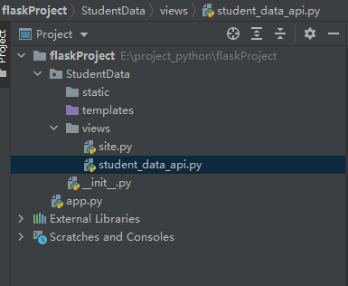

## Python Web框架flask及blueprint的上手使用


### 安装依赖库
`pip install flask`

### 创建项目

可使用 Pycharm 直接创建 flask 项目，或直接新建.py文件,Pycharm创建的 flask 项目文件 app.py 内容如下(也可手动创建)
```
from flask import Flask
app = Flask(__name__)

@app.route('/')
def hello_world():
    return 'Hello World!'

if __name__ == '__main__':
    app.run()
	
```

此时，在浏览器地址栏输入`http://127.0.0.1:5000`即可

### Blueprint 的使用

为了更好的组织代码、管理Restful接口，可使用 Blueprint 进行“模块化”管理。以学生数据接口与网页显示数据两种不同的接口形式来示例。
先看一下项目结构：


`views`文件夹分别是两个 Blueprint。

`site.py` 代码示例：
```
# -*- coding: UTF-8 -*-
from flask import Blueprint

site = Blueprint("site", __name__)


@site.route("/index", methods=["GET"])
def home():
    return "this is the home page"

```
`student_data_api.py` 代码示例
```
# -*- coding: UTF-8 -*-
from flask import Blueprint

stu_data_api = Blueprint('stu_data_api', __name__)


@stu_data_api.route('/data', methods=['GET', 'POST'])
def get_data():
    return {"name": "John", "age": 25}

```

上面定义了两个`Blueprint`对象,`site`和`stu_data_api`,`Blueprint`对象需要在`Flask`对象中注册，在`__init__.py` 中注册
```
# -*- coding: UTF-8 -*-
from .views.site import site
from .views.student_data_api import stu_data_api

from flask import Flask


def create_app():
    app = Flask(__name__)

    app.register_blueprint(site)
    app.register_blueprint(stu_data_api, url_prefix="/stu")

    return app
```

### 修改app.py再次启动

```
from StudentData import create_app

app = create_app()

if __name__ == '__main__':
    app.run()

```
