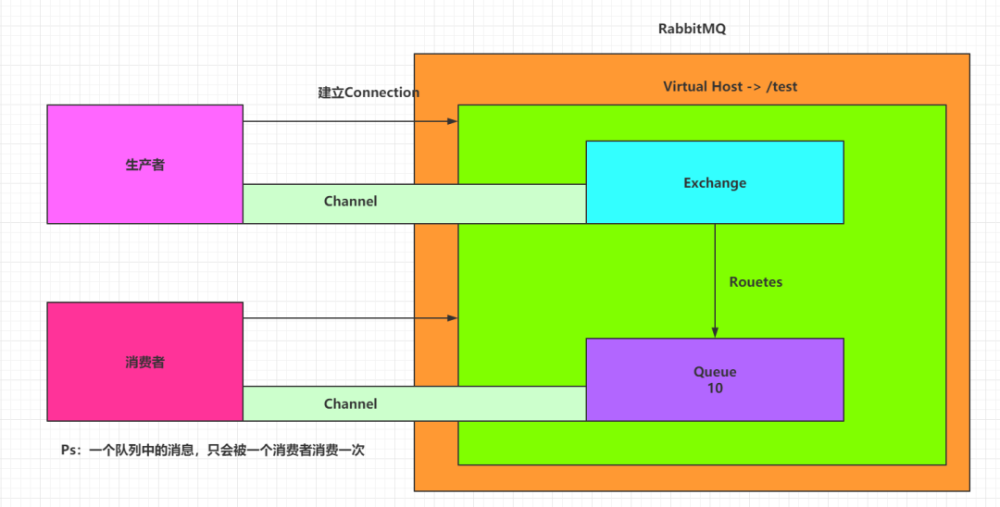

# 概述




# 消息收发

## 环境安装
安装`pika`依赖
```
pip install pika
```

## Queue模式
**生产者**
```
# -*- coding: utf-8 -*-

import time
import pika
import json


# 指定远程rabbitmq的主机地址、用户名密码
username = 'guest'
pwd = 'guest'
ip_addr = '127.0.0.1'
port_num = 5672
credentials = pika.PlainCredentials(username, pwd)
# heartbeat设置为0表示永久连接
connection = pika.BlockingConnection(pika.ConnectionParameters(ip_addr, port_num, '/', credentials, heartbeat=0))
# 设置消息有效期,过期则删除
args = {"x-message-ttl": 100*1000}
channel = connection.channel()
# 声明队列名称
queue_name = 'test'
channel.queue_declare(queue=queue_name,  arguments=args)

while True:
    msg = {
        "msg": f"hello world {time.strftime('%Y-%m-%d %H:%M:%S',time.localtime())}"
    }
    # 消息发布
    channel.basic_publish(exchange='',routing_key=queue_name,body=json.dumps(msg))
    print(f" [x] Sent {json.dumps(msg)}")
    time.sleep(1.5)
    
# 关闭连接
# connection.close()

```
**消费者**
```
# -*- coding: utf-8 -*-

import pika
import numpy as np
import base64
import cv2 
from pika.adapters.blocking_connection import BlockingChannel
from pika.spec import Basic
from pika.spec import BasicProperties

def callback(ch:BlockingChannel, method:Basic.Deliver, properties:BasicProperties, body:bytes):
    print('Receive: {}'.format(str(body,encoding='utf-8')))
    

# # 指定远程rabbitmq的主机地址、用户名密码,建立连接跟发送端的一样
username = 'guest'
pwd = 'guest'
ip_addr = '127.0.0.1'
port_num = 5672

credentials = pika.PlainCredentials(username, pwd)
# heartbeat设置为0表示永久连接
connection = pika.BlockingConnection(pika.ConnectionParameters(ip_addr, port_num, '/', credentials, heartbeat=0))

# 设置消息有效期,过期则删除
args = {"x-message-ttl":100*1000}
queue_name = 'test'

channel = connection.channel()
channel.queue_declare(queue=queue_name,auto_delete=True,arguments=args)

# 注册回调函数callback
channel.basic_consume(on_message_callback=callback, queue=queue_name, auto_ack=True)

# 进入事件循环
channel.start_consuming()
```

> 注：上述模式适用于单个生产者和单个消费者的模式，当有多个消费者同时消费同一个生产者时，会使用轮训的模式瓜分队列中的消息数据


## 广播模式
使用`RabbitMQ`提供的`Exchange`机制，可将消息分发到多个`Queue`中，示例如下:

**生产者**
```
import json
import pika
import datetime
 
#生成消息入口处
def get_message():
    for i in range(10):
        message=json.dumps({'id': "10000%s" % i, "amount": 100 * i,"name":"aoto","createtime":str(datetime.datetime.now())})
        producter_fanout(message)
 
 
def producter_fanout(messages):
    host='172.16.210.212'
    username='guest'
    passwd='guest'
    # 设置消息有效期,过期则删除
    args = {"x-message-ttl": 100*1000}
    # 获取与rabbitmq 服务的连接，虚拟队列需要指定参数 virtual_host，如果是默认的可以不填（默认为/)，也可以自己创建一个
    connection = pika.BlockingConnection(pika.ConnectionParameters(host=host, port=5672, credentials=pika.PlainCredentials(username, passwd)))
    # 创建一个 AMQP 信道（Channel）
    channel = connection.channel()
    # 声明exchange名为aoto_test的交换机，如不存在，则创建。type=fanout表示所有消息都可以送达到所有的queue中.durable = True 代表exchange持久化存储
    channel.exchange_declare(exchange='aoto_test',exchange_type='fanout')
    # 向exchange名为aoto_test的交换机，routing_key 不需要配置，body是要处理的消息，delivery_mode = 2 声明消息在队列中持久化，delivery_mod = 1 消息非持久化。
    channel.basic_publish(exchange ='aoto_test', routing_key='', body=messages,properties=pika.BasicProperties(delivery_mode=1))
    # 关闭与rabbitmq的连接
    connection.close()
if __name__=="__main__":
    get_message()
```
**消费者**
```
import pika
import random

# 定义回调处理消息的函数
def callback(ch, method, properties, body):
    # 确认收到，防止交换机中的消息被重复消费
    ch.basic_ack(delivery_tag=method.delivery_tag)
    print(body)

def consumer_fanout():
    host='172.16.210.212'
    username='guest'
    passwd='guest'
    # 获取与rabbitmq 服务的连接
    connection = pika.BlockingConnection(pika.ConnectionParameters(host=host, port=5672, credentials=pika.PlainCredentials(username,passwd)))
    # 创建一个 AMQP 信道（Channel）
    channel = connection.channel()
    # 设置消息有效期,过期则删除
    args = {"x-message-ttl": 100*1000}
    # 声明exchange名为aoto_test的交换机，如不存在，则创建。type=fanout表示所有消息都可以送达到所有的queue中.durable = True 代表exchange持久化存储
    channel.exchange_declare(exchange='aoto_test', exchange_type='fanout', durable=False,arguments=args)
    # 创建一个队列名称
    # queuename="tester"+str(random.randrange(10,1000))
    queuename="queue_aoto_1" # queue名称可随机创建,添加 exclusive=True 配置仅当前连接可用
    result=channel.queue_declare(queue=queuename)
    # 将exchange 与queue 进行绑定
    channel.queue_bind(exchange='aoto_test', queue=queuename)
    
    #告诉rabbitmq，用callback来接收并处理消息
    channel.basic_consume(result.method.queue,callback,False)
    # 开始接收信息，并进入阻塞状态，队列里有信息才会调用callback进行处理
    channel.start_consuming()
 
if __name__=="__main__":
    consumer_fanout()
```
> 注： 此模式支持多个消费者同时订阅，订阅绑定不同的queue即可。


# 参考链接
- https://www.modb.pro/db/234356
欢迎使用 **{小书匠}(xiaoshujiang)编辑器**，您可以通过 `小书匠主按钮>模板` 里的模板管理来改变新建文章的内容。