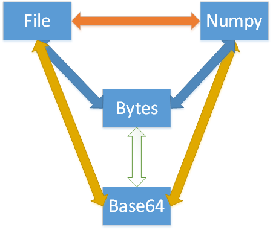

# 概述
本篇记录图片文件、二进制数据、numpy多维数组以及base64字符串之间的相互转换关系，如下图所示：



# 示例代码
现已将功能代码整理为工具类`ImageTransferTool`,主要依赖`opencv` `numpy`,使用前需要安装依赖：

```bash?linenums
pip install numpy opencv-python
```

工具类代码如下：
```python?linenums
import cv2
import numpy as np
import base64
class ImageTransferTool(object):
    def __init__(self):
        self.default_charset = 'utf-8'
        self.default_extension = '.jpg'

    def numpy_to_base64(self, image_np: np.ndarray, charset=None) -> str:
        """
        numpy数据转换成base64字符串
        Args:
            image_np: numpy.ndarray格式的对象
            charset: 编码格式,默认使用 UTF-8

        Returns: str 返回base64格式的字符串

        """
        if charset is None:
            charset = self.default_charset
        data = cv2.imencode(self.default_extension, image_np)[1]
        image_bytes = data.tobytes()
        image_base4 = base64.b64encode(image_bytes).decode(charset)
        return image_base4

    def numpy_to_bytes(self, image_np: np.ndarray) -> bytes:
        """
        numpy数据转换成bytes对象
        Args:
            image_np: numpy.ndarray格式的对象

        Returns: bytes

        """

        data = cv2.imencode(self.default_extension, image_np)[1]
        image_bytes = data.tobytes()
        return image_bytes

    @staticmethod
    def numpy_to_file(image_np: np.ndarray, output_filename: str) -> str:
        cv2.imwrite(output_filename, image_np)
        return output_filename

    @staticmethod
    def bytes_to_numpy(image_bytes: bytes) -> np.ndarray:
        image_np = np.frombuffer(image_bytes, dtype=np.uint8)
        image_np2 = cv2.imdecode(image_np, cv2.IMREAD_COLOR)
        return image_np2

    def bytes_to_base64(self, image_bytes: bytes, charset: str = None) -> str:
        if charset is None:
            charset = self.default_charset
        image_base4 = base64.b64encode(image_bytes).decode(charset)
        return image_base4

    @staticmethod
    def bytes_to_file(image_bytes: bytes, output_filename) -> str:
        with open(output_filename, 'wb') as f:
            f.write(image_bytes)
            return output_filename

    @staticmethod
    def file_to_numpy(file_path: str) -> np.ndarray:
        image_np = cv2.imread(file_path)
        return image_np

    @staticmethod
    def file_to_bytes(file_path: str) -> bytes:
        with open(file_path, 'rb') as f:
            image_bytes = f.read()
            return image_bytes

    def file_to_base64(self, file_path: str) -> str:
        with open(file_path, 'rb') as f:
            image_bytes = f.read()
            image_base64 = base64.b64encode(image_bytes).decode(self.default_charset)
            return image_base64

    @staticmethod
    def base64_to_bytes(image_base64: str) -> bytes:
        image_bytes = base64.b64decode(image_base64)
        return image_bytes

    @staticmethod
    def base64_to_numpy(image_base64: str) -> np.ndarray:
        image_bytes = base64.b64decode(image_base64)
        image_np = np.frombuffer(image_bytes, dtype=np.uint8)
        image_np2 = cv2.imdecode(image_np, cv2.IMREAD_COLOR)
        return image_np2

    @staticmethod
    def base64_to_file(image_base64: str, output_filename: str) -> str:
        image_bytes = base64.b64decode(image_base64)
        with open(output_filename, 'wb') as f:
            f.write(image_bytes)
            return output_filename

```
欢迎使用 **{小书匠}(xiaoshujiang)编辑器**，您可以通过 `小书匠主按钮>模板` 里的模板管理来改变新建文章的内容。