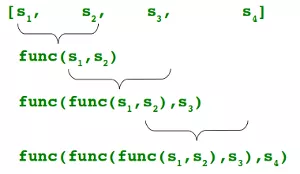

# 概要
记录几个新手必备的函数。对于写出更加优雅的Python代码比较有帮助。

---

### 1. lambda函数

匿名函数 (anonymous function) 是指一类无需定义标志符（函数名）的函数、通俗来讲，就是它可以使我们的函数，可以不要函数名。

正常情况下，定义一个函数，使用`def`关键字，而使用匿名函数，则使用`lambda`。

举例说明：
```
def sum(a,b):
	return a+b

sum(3,4)

# 返回 7

(lambda x,y : x+y)(3,4)

# 返回 7

```
上面两个函数的实现是等价的，匿名函数直接运行，代码简洁。

其他用法：
1. 逻辑判断
 ```
 (lambda x,y : x if x < y else y )( 1, 2)
 # 返回 1
 
 等价于
 
 def get_smaller_num(x, y):
 	if x < y:
		return x
	else:
		return y
```

2. 嵌套函数
```
( lambda x: ( lambda y : ( lambda z : x + y + z )( 1 ) )( 2 ))( 3 )
# 返回 6
# 可读性较低，慎用
```

3. 递归函数
```
# 计算阶乘
func = lambda n:1 if n == 0 else n*func(n-1) 
func(5)
# 返回120

 等价于
 
 def get_factorial(n):
 	if n==0:
		return 1
	else :
		return n * get_factorial(n-1)
```
从以上示例来看，lambda 表达式和常规的函数相比，写法比较怪异，可读性相对较差。除了可以直接运行之外，好像并没有其他较为突出的功能，为什么在今天我们要介绍它呢？

首先我们要知道 lambda 是一个表达式，而不是一个语句。正因为这个特点，我们可以在一些特殊的场景中去使用它。具体是什么场景呢？接下来介绍几个非常好用的内置函数。

### 2. map 函数
map 函数，它接收两个参数，第一个参数是一个函数对象（当然也可以是一个lambda表达式），第二个参数是一个序列。

举例说明其功能实现
```
map (lambda x: x*2, [1,2,3,4,5])
# python 3.x 返回迭代器对象 <map object at 0x000001F854794CF8>，
# python 2.x 直接返回list对象: [2,4,6,8,10]
```
可以很清楚地看到，它可以将后面序列中的每一个元素做为参数传入lambda中。

当不使用 map 函数时，也可以这样写：
```
my_list = []

for i in [1,2,3,4,5]:
	my_list.append(i*2)
```

### 3.filter 函数
filter 函数，和 map 函数相似。同样也是接收两个参数，一个lambda 表达式，一个序列。

它会遍历后面参数(**序列**)中每一个元素，并将其做为参数传入lambda表达式中，当表达式返回 True，则元素会被保留下来，当表达式返回 False ，则元素会被丢弃。

举例说明，过滤出列表中小于0的元素：
```
filter(lambda x: x < 0,range(-5, 5))
# python 3.x 返回迭代器对象 <filter object at 0x000001F8547306D8>
# python 2.x 直接返回list对象: [-8,-4,-3,-2,-1]
```
### 4. reduce 函数

reduce 函数，也是类似的。它的作用是先对序列中的第 1、2 个元素进行操作，得到的结果再与第三个数据用 lambda 函数运算，将其得到的结果再与第四个元素进行运算，以此类推下去直到后面没有元素了。




举例说明：
```
# 使用前需导入
from functools import reduce

reduce(lambda x,y:x+y, [1,2,3,4,5])
# 返回 15
# 运算过程
1+2=3
3+3=6
6+4=10
10+5=15
```

