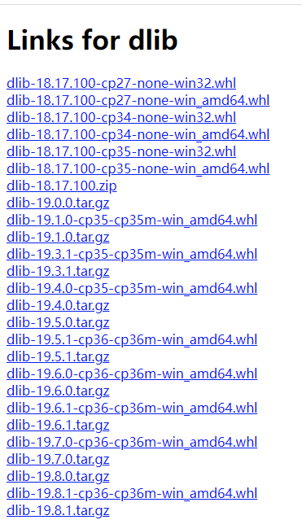

# `dlib`概述
`Dlib`是一个包含机器学习算法的`C++`开源工具包。`Dlib`可以帮助您创建很多复杂的机器学习方面的软件来帮助解决实际问题。目前`Dlib`已经被广泛的用在行业和学术领域，包括机器人，嵌入式设备，移动电话和大型高性能计算环境.

# DLIB CPU版本安装

## 使用pip安装最新版本
`Windows`平台使用`pip`指令安装`dlib`依赖库时，往往会遇到报错问题，如下：
```
 Building wheel for dlib (setup.py) ... error 
  ERROR: Command errored out with exit status 1:
   command: 'd:\python36\python.exe' -u -c 'import io, os, sys, setuptools, 
   中间省略若干行...
  package init file 'tools\python\dlib\__init__.py' not found (or not a regular file)
  running build_ext
  ERROR: CMake must be installed to build dlib
  ----------------------------------------
  ERROR: Failed building wheel for dlib
```
解决这个报错问题，只需要在执行`pip install dlib`之前，在虚拟环境中安装`cmake`组建即可，完整代码如下：
```
# 进入虚拟环境
conda activate your_env_name

# 安装编译工具
pip install cmake

# 安装最新版dlib,此指令执行后，会下载最新的源码在本地编译安装，耗时较长
pip install dlib
```
## 使用whl安装旧版本
`pypi`[官方网站](`https://pypi.org/simple/dlib/`)提供了已经编译好的whl文件提供下载，截止到本文档编写之日(20211110),列举出了适配python 3.6版本及以下以及python 2.x版本的二进制安装包文件 (最新版本的只有源码，没有二进制安装包)。如下图所示


至此，可通过以下方式安装对应的whl文件：

1. 下载`whl`文件，以`dlib19.8.1`为例，`pip install dliv-19.8.1-cp36-cp36m-win_amd64.whl` 即可完成安装 ;
2. 通过右击鼠标获取对应包文件的链接，同样以`dlib19.8.1`为例，`pip install [文件链接]`，链接太长且不确定是否会变化，就不放在这儿了;
3. 直接指定安装`whl`文件的对应版本号，如`pip install dlib==19.8.1`

## `conda`工具安装

`conda `用户直接使用`conda install dlib` 即可。
>  有一定概率会失败，取决于不同机器上的anaconda的配置


# DLIB CUDA版本安装
## 环境要求

1. 操作系统:windows 10 
2. Microsoft Visual Studio 2015 update3 (或者2017、2019)
3. CMake
4. Anaconda 或 python 3.5 以上环境
5. 已经正确安装NVIDIA driver、CUDA和 cuDNN
6. dlib源代码(从[github地址](https://github.com/davisking/dlib)下载源代码)

## 编译安装


```
# 下载源码，已下载跳过此步骤
git clone https://github.com/davisking/dlib.git
cd dlib
mkdir build
cd build

# 重要步骤，使用VS工具编译
cmake .. -G "Visual Studio 14 2015 Win64" -T host=x64

# 不同版本的VS指令不同,根据本地机器的版本选择其中一条指令执行即可
# VS 2015 update 3
# cmake .. -G "Visual Studio 14 2015 Win64" -T host=x64
# VS 2017
cmake .. -G "Visual Studio 15 2017" -T host=x64 -A x64
# VS 2019 
cmake .. -G "Visual Studio 16 2019" -T host=x64 -A x64

cmake --build .
cd ..
# 进入虚拟环境，已进入或者不需要安装到虚拟环境的请忽略
conda activate your_env_name

# 安装dlib库
python setup.py install
```

## CMake-GUI编译安装
1. 本实例中，下载的dlib版本号为`19.22`，源代码文件夹为`dlib-19.22`,存放路径为`e:\dlib_cuda\dlib-19.22`；
2. 创建同级文件夹`build`
3. 打开cmake-gui,`where is the source code`选择dlib源码位置,本实例中是`e:\dlib_cuda\dlib-19.22\dlib`(`github`下载的源代码文件的下一级目录)，
4.  `where to build the binaries`选择上一步新建的文件夹`e:\dlib_cuda\build`,
5.  点击`config`,选择`Visual Studio 2019`、`x64架构`点击Finish并等待完成即可
6. 进入anaconda或python虚拟环境，安装cmake依赖
 	`pip install cmake` 
7. 命令行进入dlib-19.22文件夹，执行指令`python setup.py install`
	> 这个过程需要进行源码的编译与安装，会占用CPU资源和几分钟的时间，等待安装结束即可

8. 验证dlib安装是否成功	
    ```
	在命令行进入`python`，键入以下指令:
	>>> import dlib
	>>> dlib.DLIB_USE_CUDA
	True

	结果显示为 True 即表示dlib安装成功
    ```
	
# 编译时的报错问题

## 报错 error C2734: “GifAsciiTable8x8”
```
error C2734: “GifAsciiTable8x8”: 如果不是外部的，则必须初始化常量对象

 File "setup.py", line 134, in run
    self.build_extension(ext)
  File "setup.py", line 174, in build_extension
    subprocess.check_call(cmake_build, cwd=build_folder)
  File "D:\Anaconda3\lib\subprocess.py", line 364, in check_call
    raise CalledProcessError(retcode, cmd)
subprocess.CalledProcessError: Command '['cmake', '--build', '.', '--config', 'Release', '--', '/m']' returned non-zero exit status 1.

```
## 报错 error C2734原因及解决方法
原因是：CMake 没有找到计算机环境里面的 libfig库
解决方法：
添加参数，不启用 `gif support`，指令如下：
`python setup.py install --no DLIB_GIF_SUPPORT`

欢迎使用 **{小书匠}(xiaoshujiang)编辑器**，您可以通过 `小书匠主按钮>模板` 里的模板管理来改变新建文章的内容。