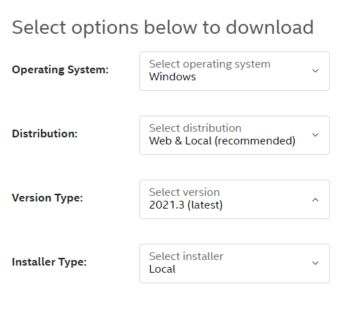
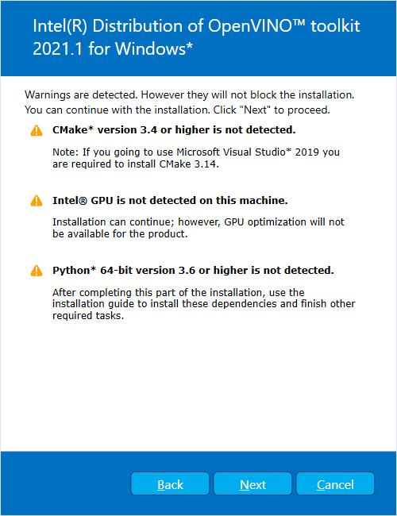
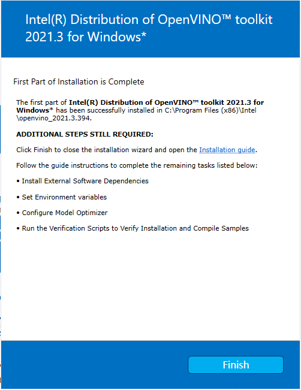
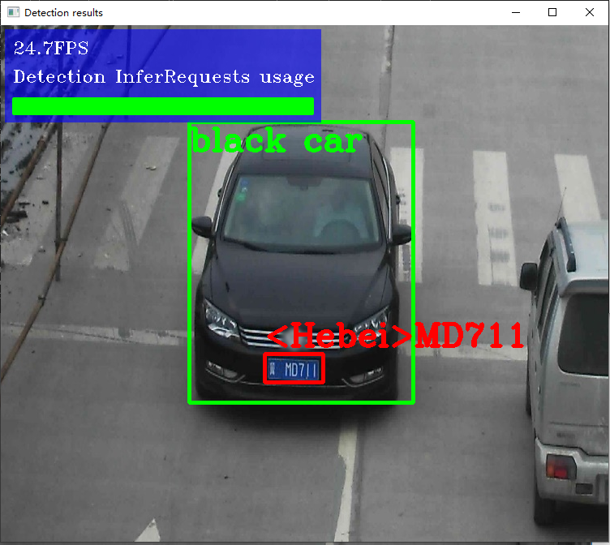

[toc]
#  前言

本指南适用于 `Microsoft Windows* 10 64 位`。 有关 `Linux*` 操作系统信息和说明，请参阅 `Linux `[安装指南](https://docs.openvinotoolkit.org/latest/openvino_docs_install_guides_installing_openvino_linux.html)。

> 提示：您可以使用 `OpenVINO™` 深度学习工作台 (`DL Workbench`) 内的模型优化器快速入门。 `DL Workbench` 是一个 `OpenVINO™` 用户接口，可让您导入模型、分析其性能和准确性、可视化输出、优化和准备模型以在各种Intel® 平台上部署。

# 介绍

> 重要提示:
> - 除有特殊说明外，本指南中的所有步骤都必须执行
> - 除下载安装包以外,也必须安装依赖，完成所有的配置

## 完成以下所有步骤，即可完成安装：
1.  安装 `Intel® OpenVINO™` 核心工具组件
2. 安装依赖工具与软件
	- `Microsoft Visual Studio* 2019 with MSBuild`
	- `CMake 3.14 or higher 64-bit`
	- `Python 3.6 - 3.8 64-bit`
	> 重要提示: 作为安装流程中的一部分, 请确认在安装`Python`依赖时，勾选`Add Python 3.x to PATH`将`Python`安装路径添加到`PATH`环境变量中。

3.  设置环境变量
4. 配置模型优化器 (`Model Optimizer`)
5. *非必选安装步骤*: 
	- 安装`windows`版本`Intel® Graphics` 驱动
	- 使用 `Intel® Movidius™ VPU` 为`Intel® Vision Accelerator Design`(`intel`视觉加速器设计)安装驱动程序和软件
	- 更新 `Windows*` 环境变量(如果安装`Python`时没有勾选`add Python to the path` 则此步骤为必需项)

此外，本指南同样涵盖以下步骤：
- 代码示例和入门演示程序
- 卸载`OpenVINO™` 工具套装

# 关于 Intel  OpenVINO™ 工具包的介绍
`OpenVINO™` 工具包是一个全面的工具包，用于快速开发解决各种任务的应用程序和解决方案，包括模拟人类视觉、自动语音识别、自然语言处理、推荐系统等。 该工具包基于最新一代人工神经网络，包括卷积神经网络 (`CNN`)、循环网络和基于注意力的网络，可跨英特尔® 硬件扩展计算机视觉和非视觉工作负载，从而最大限度地提高性能。 它通过从边缘主机到云端部署的高性能、人工智能和深度学习推理来加速应用程序。更多详细信息，请见[详情页](https://software.intel.com/en-us/OpenVINO-toolkit)


## OpenVINO 发行版功能
本指南主要讲述的时适用于` Windows* 10 `操作系统的`OpenVINO` 工具套件发行版的主要优点，包括：
- 启用基于`CNN`的深度学习推理边缘计算
- 支持跨`Intel® CPU`、`Intel® GPU`、`Intel® Neural Compute Stick  2` 和`Intel® Vision Accelerator Design`与`Intel® Movidius™ VPU` 的异构执行
- 通过易于使用的计算机视觉功能库和预先优化的内核加快上市时间
- 包括对计算机视觉标准的优化调用，包括 `OpenCV*` 和 `OpenCL™`
 
 ## OpenVINO组件
本次安装默认包含以下组件

|  组件   |  描述  |
| ------------------------- | ------------------------ |
| Model Optimizer     |   该工具将在流行框架中训练的模型导入、转换和优化为英特尔工具（尤其是推理引擎）可用的格式。注意：流行的框架包括 Caffe*、TensorFlow*、MXNet* 和 ONNX* 等框架。|
 Inference Engine     |这是运行深度学习模型的引擎，包含一系列可轻松将推理整合到应用的依赖库。|
| OpenCV*                |	OpenCV* community version compiled for Intel® hardware |
| Inference Engine Samples |	一组简单的控制台应用程序，演示如何在应用程序中使用Intel的深度学习推理引擎。.|
| Demos                  |	一组控制台应用程序，演示如何在应用程序中使用推理引擎来解决特定用例|
| Additional Tools |	一组用于模型的工具，包括精度检查器实用程序、训练后优化工具指南、模型下载器等 |
| Documentation for Pre-Trained Models |	Open Model Zoo 存储库中提供的预训练模型的文档 |

# 系统要求
## 硬件要求

 - 第 6 代至第 11 代英特尔® 酷睿™ 处理器和英特尔® 至强® 处理器
 - 第三代英特尔® 至强® 可扩展处理器（原代号为 `Cooper Lake`）
 - 英特尔® 至强® 可扩展处理器（以前称为 `Skylake` 和 `Cascade Lake`）
 - 英特尔凌动® 处理器，支持英特尔® Streaming SIMD Extensions 4.1（英特尔® SSE4.1）
 - 英特尔奔腾® 处理器 N4200/5、N3350/5 或 N3450/5 与英特尔® 高清显卡
 - 英特尔® 锐炬® Xe MAX 显卡
 - 英特尔® 神经计算棒 2(`Neural Compute Stick 2`)
 - 采用Intel® Movidius™ VPU 的Intel® 视觉加速器设计(`Vision Accelerator Design`)

> 注: `OpenVINO™ 2020.4`不再支持 `Intel® Movidius™ Neural Compute Stick`.

> 关于处理器：
> - 并非所有处理器都包含处理器图形。 有关处理器的信息，请参阅处理器规格。[详细链接](https://ark.intel.com/content/www/us/en/ark.html#@Processors)
> - 如果您使用的是英特尔至强处理器，则需要支持处理器图形的芯片组。 有关您的芯片组的信息，请参阅芯片组规格。[详细信息](https://ark.intel.com/content/www/us/en/ark.html#@Chipsets)

## 操作系统
`Microsoft Windows* 10 64-bit` 

## 软件要求

 - `Microsoft Visual Studio* with C++ 2019 or 2017 with MSBuild` [下载链接](http://visualstudio.microsoft.com/downloads/)
 - `CMake 3.10 or higher 64-bit`
	> 注: 如果您需要使用 `Microsoft Visual Studio 2019`, 需要安装 `CMake 3.14`.[下载链接](https://cmake.org/download/)
- `Python 3.6 - 3.8 64-bit` [下载链接](https://www.python.org/downloads/windows/)

# 安装步骤

> 请确保您的硬件满足上述系统需求，软件依赖如 `Microsoft Vusual Studio` 和 `CMake `已安装

## 安装 Intel® of OpenVINO™ 工具包核心组件

 1. 如果您还没有下载 Intel® Distribution of OpenVINO™ 工具包, [点击此处下载](https://software.intel.com/content/www/us/en/develop/tools/openvino-toolkit/download.html).下载的安装包默认文件名为 `w_openvino_toolkit_p_<version>.exe`.  
   
 
	> 推荐：从上到下依次选择操作系统、发行版本、软件版本、安装方式，建议选项分别为：`Windows`、`Web & Local 2021.3`、`Local`，即选择适用于`Windows`平台的`2021.3`版本的`本地安装包`

 2. 双击安装包，会弹出安装界面并让您选择安装路径，默认安装路径是` C:\Program Files (x86)\Intel\openvino_<version>`，为简化操作，会同时创建一个快捷方式指向这个安装目录` C:\Program Files (x86)\Intel\openvino_2021` ，如果您选择其他路径，同样会创建快捷方式
	> 注：如果在此前，您系统中已经安装了OpenVINO™ 工具，此次安装会使用已有的安装路径再次安装，如果您需要在其他路径安装此新版本，需要卸载原有的旧版本

 3. 点击`next`，选择是否允许软件收集与发送使用信息，随便选一个，再点击`next`
 4. 如果您缺少外部依赖项，您将看到一个警告屏幕。 写着您缺少的依赖项。 此时您无需采取其他措施。 安装 `Intel® Distribution of OpenVINO™` 工具套件核心组件后，再安装缺少的依赖项。 下面的截图表明您缺少两个依赖项(显示有三个警告，中间的GPU可忽略，两个缺少的依赖项应该是`Python`和`CMake`)：
 
5. 点击next，出现以下截图时，表示第一部分的安装已经完成。
   

## 安装依赖
如此前提到的关于MS Visual Studio和CMake已经安装，跳过此步骤到`配置环境变量`模块即可
1. 安装 `Microsoft Visual Studio* with C++ 2019 or 2017 with MSBuild` [下载链接](http://visualstudio.microsoft.com/downloads/)
2. 安装 `CMake 3.14`.[下载链接](https://cmake.org/download/)
 
## 配置环境变量

> 注: 如果您将OpenVINO 安装在非默认安装路径,在执行以下配置命令时将`C:\Program Files (x86)\Intel`替换您当前的安装路径。

您必须先更新多个环境变量，然后才能编译和运行 `OpenVINO` 应用程序。 打开命令提示符，并运行 `setupvars.bat`批处理文件来临时设置您的环境变量：
`C:\Program Files (x86)\Intel\openvino_2021\bin\setupvars.bat`
执行结果如下
```
C:\Users\aoto>C:\"Program Files (x86)"\Intel\openvino_2021\bin\setupvars.bat
Python 3.6.8
[setupvars.bat] OpenVINO environment initialized
```

> 重要提示: 不建议使用 Windows PowerShell* 运行这个配置脚本，推荐使用命令行工具。

环境变量已经设置好了，接下来配置`Model Optimizer`

 ## 配置`Model Optimizer`
 > 重要提示: 这些步骤是必需的。 您必须为至少一个框架配置模型优化器。 如果您不完成本节中的步骤，模型优化器将失败。


 ### Model Optimizer 说明
模型优化器是英特尔® `OpenVINO` 工具套件发行版的关键组件。 如果不通过模型优化器运行模型，就无法对经过训练的模型进行推理。 当您通过模型优化器运行预训练模型时，您的输出是网络的中间表示 (IR)。 IR 是描述整个模型的一对文件：
- .xml: 网络拓扑结构的描述
- .bin: 含权重和偏差二进制数据

推理引擎使用跨 `CPU`、`GPU `或 `VPU `硬件的`通用 API` 读取、加载和推断 `IR `文件。

模型优化器是一个基于 `Python` 的命令行工具 (`mo.py`)，位于 `C:\Program Files (x86)\Intel\openvino_2021\deployment_tools\model_optimizer`。 在使用 `Caffe`、`TensorFlow`、`MXNet `和 `ONNX `等流行深度学习框架训练的模型上使用此工具，将它们转换为推理引擎可以使用的优化的 `IR` 格式。

本节说明如何使用脚本同时为所有支持的框架或单个框架配置模型优化器。 如果您想手动配置模型优化器而不是使用脚本，请参阅配置模型优化器页面上的使用手动配置过程部分。

有关模型优化器的更多信息，请参阅模型优化器开发人员指南。
	
###  Model Optimizer 配置步骤

您可以一次为所有支持的框架或一次为一个框架配置模型优化器。 选择最适合您需求的选项。 如果您看到错误消息，请确保您安装了所有依赖项。

> 重要提示：需要访问 Internet 才能成功执行以下步骤。 如果您只能通过代理服务器访问 Internet，请确保在您的环境中已经正确配置。


> 请注意 ： 
> - 如果您想从已安装的`OpenVINO` 的另一个已安装版本中使用`模型优化器`，请将 `openvino_2021` 替换为 `openvino_<version>`，其中` <version>` 是所需的版本。
> - 如果您将`OpenVINO`安装到非默认安装目录，请将 `C:\Program Files (x86)\Intel` 替换为您安装该软件的目录。

以下步骤请使用命令行界面执行以确保再报错时可以看到错误信息：

 - **选项一** 
	1. 打开命令行(cmd.exe)
	2. 进入脚本目录 
	`cd C:\Program Files (x86)\Intel\openvino_2021\deployment_tools\model_optimizer\install_prerequisites`
	3. 执行脚本
	`install_prerequisites.bat`
 - **选项二** 
	 - 打开命令行
	 - 进入脚本目录 `cd C:\Program Files (x86)\Intel\openvino_2021\deployment_tools\model_optimizer\install_prerequisites`
	 - 分别为不同的框架运行不同的配置脚本，可运行多次(不同的脚本)
		  - Caffe框架
		`install_prerequisites_caffe.bat`
		  - TensorFlow 1.x
			`install_prerequisites_tf.bat`
		  - TensorFlow 2.x
			`install_prerequisites_tf2.bat`
		  - MXNet
			`install_prerequisites_mxnet.bat`
		  - ONNX
			`install_prerequisites_onnx.bat`
		  - Kaldi
			`install_prerequisites_kaldi.bat`

以上两个安装选项任选其一即可，推荐使用选项一，执行次数少，方便快捷。

# OpenVINO工作流与Demo试运行

## OpenVINO 组件介绍

工具包由三个主要组件组成：

- `Model Optimizer`(模型优化器)：优化英特尔架构的模型，将模型转换为与推理引擎兼容的格式。此格式称为中间表示 （IR）。
- `Intermediate Representation`(简称 IR)：模型优化器输出。模型转换为已优化为英特尔架构的格式，可通过推理引擎使用。
- 推理引擎：针对 IR（优化模型）运行推理以生成推理结果的软件库。

此外，还提供演示脚本、代码示例和演示应用程序，以帮助您使用工具包启动和运行：

- 演示脚本 - 自动执行工作流步骤以显示不同场景的运行推理管道的批次脚本。
- 代码示例 - 显示如何：
	- 在应用程序中使用特定的 OpenVINO 功能。
	- 执行特定任务，如加载模型、运行推理、查询特定设备功能等。
- 演示应用程序 - 提供强大应用程序模板以帮助您实现特定深度学习场景的控制台应用程序。这些应用程序涉及越来越复杂的处理管道，这些管道从同时运行推理的多个模型中收集分析数据，例如在视频流中检测一个人，以及检测人的身体属性，如年龄、性别和情绪状态。

## OpenVINO 工作流
简化的OpenVINO工作流程是：

 1. 获取预训练模型，可执行如行人检测、人脸检测、车辆检测、车牌识别、头部姿势等推理任务
 2. 运行预训练模型，通过`Model Optimizer`,将模型转化为中间形式(`Intermediate Representation`，简称` IR`),`IR `包含一对作为推理引擎的输入之的`.xml`文件按和`.bin`文件
 3. 在应用程序中使用推理引擎 `API `对 `IR`（优化模型）运行推理和输出推理结果。该应用程序可以是一个`OpenVINO`示例，或您自己的应用程序。

## 运行demo
`OpenVINO`内置运行Demo脚本位于` <INSTALL_DIR>\deployment_tools\demo`,可以作为了解`OpenVINO`的工作流的简单示例。这些脚本自动执行工作流流程，针对不同场景，演示推理管道。主要演示的内容有：
 - 编译多个实例文件，这些示例文件来自于`OpenVINO`组件内置文件
 - 下载预训练模型
 - 按步骤执行并将结果显示在控制台

示例脚本可以运行在任意满足条件的设备上。默认使用`CPU`进行推理，可使用 `-d` 参数指定其他推理设备 如`GPU`，通用指令如下：
`.<script_name> -d [CPU, GPU, MYRIAD, HDDL]`

推理管道示例脚本
位于`C:\Program Files (x86)\Intel\openvino_2021\deployment_tools\demo\demo_security_barrier_camera.py`的骄傲本文件，使用车辆识别，其中车辆属性相互建立，以缩小特定属性。

脚本主要内容:

- 下载三个预训练IR模型
- 生成安保摄像头演示应用程序
- 运行程序，使用下载的模型和示例图片演示推理流程

应用程序主要功能:

- 识别被标注为车辆的对象
- 使用车辆标识作为对第二个模型的输入，该模型可识别特定车辆属性，包括车牌。.
- 使用车牌照作为第三个模型的输入，该模型识别牌照上的文字与数字

执行脚本:
```
# 进入示例脚本保存目录
cd C:\"Program Files (x86)"\Intel\openvino_2021\deployment_tools\demo\

# 运行示例脚本
.\demo_security_barrier_camera.bat
```

脚本执行过程中会访问网络下载模型等依赖，等待脚本执行完成时，弹出图片识别窗口如下图：



欢迎使用 **{小书匠}(xiaoshujiang)编辑器**，您可以通过 `小书匠主按钮>模板` 里的模板管理来改变新建文章的内容。