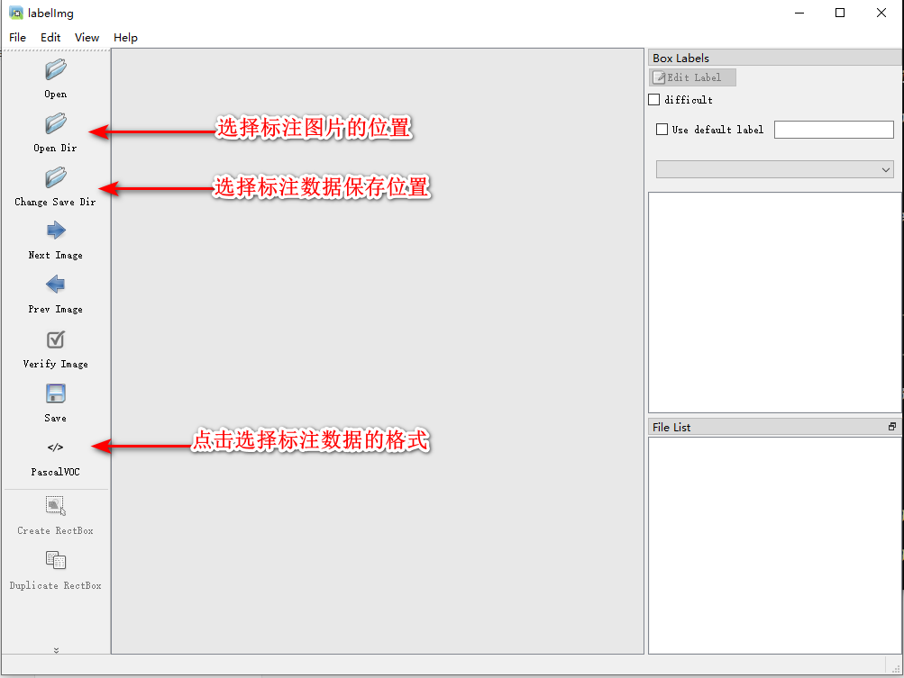

[TOC]

# 概述

本文档记录使用`Pytorch`框架训练、评估`YOLOv5`目标检测算法的环境部署、数据集处理以及其他操作流程

# 环境部署

## 先决条件与环境(`prerequisites`)

- GPU : `NVIDIA GeForce GTX1660 SUPER`

- 操作系统 : `Windows 10`
- NVIDIA驱动 : `Driver Version: 531.41`
- SDK : ` cuda_11.2` 、`cudnn 8.2.1`
- 其他: `Anaconda 4.9` 


## 环境安装

1. 创建虚拟环境并激活，访问[`Pytorch`](https://pytorch.org/get-started/previous-versions/)官方网站，查询符合本地硬件配置与软件环境安装指令，这里选择 适配 `CUDA 11.3`的`Pytorch v1.12.1`,安装指令如下:

   ```bash
   # 创建虚拟环境
   conda create -n yolo python=3.8 -y
   
   # 激活虚拟环境
   conda activate yolo
   
   # conda CUDA 11.3 
   conda install pytorch==1.12.1 torchvision==0.13.1 torchaudio==0.12.1 cudatoolkit=11.3 -c pytorch -y
   
   # pip CUDA 11.3 
   pip install torch==1.12.1+cu113 torchvision==0.13.1+cu113 torchaudio==0.12.1 --extra-index-url https://download.pytorch.org/whl/cu113
   ```

   

2. `Pytorch`安装校验,执行以下指令，查看`cuda`状态

   ```bash
   (yolo)c:\Users\Administrator> python
   Python 3.8.16 | packaged by conda-forge | (default, Feb  1 2023, 15:53:35) [MSC v.1929 64 bit (AMD64)] on win32
   Type "help", "copyright", "credits" or "license" for more information.
   >>> import torch
   >>> torch.cuda.is_available()
   True
   >>>
   ```

   输出结果为`True`,即环境安装成功.

   > 版本兼容性问题: `Pytorch`官方安装文档中，支持的`CUDA`版本为`11.8`、`11.7`、`11.6`、`11.3`和`10.2`,对于本文档中所使用的环境`CUDA v11.2`,完全适配此`CUDA`版本的`Pytorch`版本比较老旧，因此本次安装的适配`CUDA v11.3`版本的`Pytorch`,经测试发现也可以正常使用.

   > 注: 通过查询部分资料得知，`CUDA v11`版本中，部分小版本向前兼容，表现形式为版本号标为`CUDA v11.x`,此种说法待确认，后续会通过查询官方文档等方式确定是否正确。

3. 访问`YOLOv5`[开源地址](https://github.com/ultralytics/yolov5),克隆项目源码到本地，按照README文档指示，安装依赖即可,如下所示:

   ```bash
   # clone 源码
   git clone https://github.com/ultralytics/yolov5  
   cd yolov5
   # 安装依赖
   pip install -r requirements.txt  
   ```

   

4. `YOLOv5`安装校验,通过运行`detec.py`脚本，测试环境安装是否正确,如下所示:

   ```bash
   python detect.py --weights yolov5s.pt --source 0                               # webcam
                                                  img.jpg                         # image
                                                  vid.mp4                         # video
                                                  screen                          # screenshot
                                                  path/                           # directory
                                                  list.txt                        # list of images
                                                  list.streams                    # list of streams
                                                  'path/*.jpg'                    # glob
                                                  'https://youtu.be/Zgi9g1ksQHc'  # YouTube
                                                  'rtsp://example.com/media.mp4'  # RTSP, RTMP, HTTP stream
   ```

   

# 数据集标注

## 标注工具`LabelImg`

[LabelImg](https://github.com/heartexlabs/labelImg)是一款开源的图片标注工具，支持 `PASCAL VOC` 、 `YOLO` and `CreateML` 三种数据格式，可通过`pip`包管理工具安装或直接下载`exe`文件使用，[下载地址](https://github.com/heartexlabs/labelImg/releases/tag/v1.8.1),`pip`安装方式如下所示:

```
# 安装
pip install labelImg
# 启动
labelImg
```

`LabelImg`工作界面如下所示:



截止到本文档编辑时间(2023.05.11),`LabelImg`发布的Windows平台运行文件版本为`windows_v1.8.1`,其文件结构如下所示:

```
windows-v1.8.1
|
|--data
|	|--predefined_classes.txt
|
|--labelImg.exe
```

其中`data/predefined_class.txt`文件中保存了`class`列表，每个`class`一行，这样在标注数据时直接选中即可，不需要手动输入了,如下图所示：


