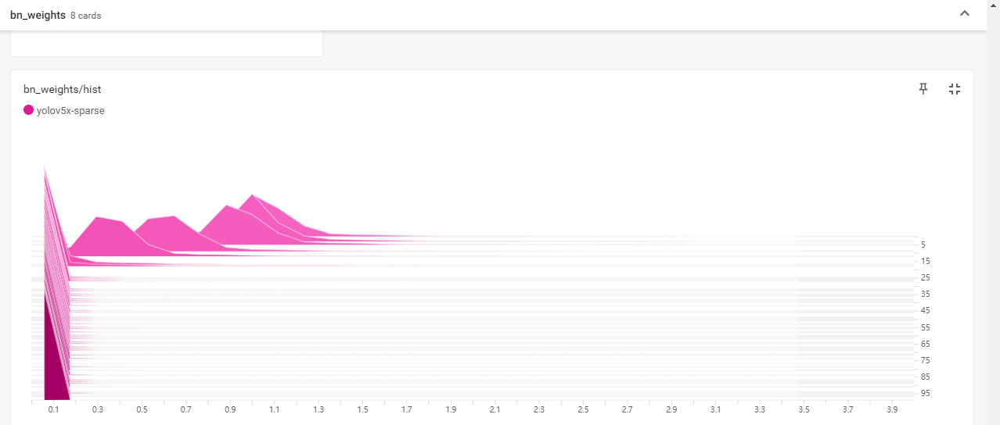

[TOC]

# 概述

本文档记录在`Windows`平台上对于`YOLOv5`模型的训练、剪枝流程与代码实现

# 环境部署

## 平台与配置

1. 操作系统: `Windows`
2. 硬件平台: `NVIDIA GeForce 2060 Super`
3. 运算平台: `CUDA 10.2` `cuDNN 7.6.5`
4. 其他环境: `Anaconda` 或`Miniconda`

> 重要提示: 由于`ultralytics`官方没有提供关于模型剪枝相关的代码，本文档中记录的剪枝操作是在官方开源代码的基础上做了一定的修改，需要特别注意版本的适配性。

> 注: 此文档中表述的内容，基于`YOLOv5`的`v6.1`版本 ,兼容`v6.0`版本。 

## 环境部署

### 安装`NVIDIA`平台工具

访问`NVIDIA`官方平台，分别下载`NVIDIA Driver`、`CUDA 10.2`、`cuDNN 7.6.5`安装包并正确安装，安装方式不再赘述.

> 注: `NVIDIA Driver`可选择适配当前硬件的最新版本，`CUDA`和`cuDNN`必须严格按照版本号进行下载安装

### 安装虚拟环境

1. 创建虚拟环境

   ```bash
   conda create -n yolo_slim python=3.8 -y
   conda activate yolo_slim
   ```

   > 注: 后续所有操作如无特殊说明，均处于虚拟环境激活的情况下执行。

   

2. 安装`Pytorch`

   ```bash
   # CUDA 10.2
   conda install pytorch==1.8.1 torchvision==0.9.1 torchaudio==0.8.1 cudatoolkit=10.2 -c pytorch -y
   ```

   > 注：更高版本的`CUDA`和`pytorch`是否适配待验证

### 安装`YOLOv5`项目依赖

1. 安装YOLOv5依赖库

   点击[链接](https://pan.baidu.com/s/1bgBI07X8Wxpc4Sx7YoPD4g)，下载源代码`yolov5-6.1-slimming.zip`(访问码:`aoto`)，和示例训练数据集`VOCdevkit_ball.zip`，将源代码解压后，按照`requirements.txt`中列举的依赖列表安装环境:

   ```bash
   cd yolov5-6.1-slimming
   pip install -r requirements.txt
   ```

2. 安装验证

   ```bash
   # 安装验证方法官方开源代码,开启本地摄像头验证模型运行
   python detect.py --weights weights/yolov5 --source 0
   ```

### 训练准备工作

1. 处理数据集

   示例数据集`VOCdevkit_ball.zip`是Pascal VOC格式的足球检测标注数据集，文件结构如下所示:

   ```
   VOCdevkit
       |--VOC2007
       	|--Annotations  # 存放XML标注文件
       	|--JPEGImages   # 存放JPG图片文件
   ```

   执行数据转换脚本`prepare_data.py`:

   ```bash
   python prepare_data.py
   ```

   生成`YOLO`格式训练集，文件结构如下:

   ```
   VOCdevkit
       |--images
       	|--train  # 存放训练集图片
       	|--val    # 存放验证集图片
       |--labels
       	|--train  # 存放训练集标注TXT文本
       	|--val    # 存放验证集集标注TXT文本
   ```

   > 注意：
   >
   > 1. `classes=["ball"]`  要根据自己的数据集类别做相应的修改
   > 2. `TRAIN_RATIO = 80` 要根据自己的数据集调整训练集所占的比例
   > 3. `convert_annotation()`方法中，根据实际情况，调整数据集的路径
   > 4. 除上述训练数据集外，还在yolov5下生成了两个文件`yolov5_train.txt`和`yolov5_val.txt`,分别记录了训练图片文件和验证图片文件的列表，含有每个图片的路径和文件名。  

2. 下载预训练模型

   下载官方[GitHub](https://github.com/ultralytics/yolov5)提供的预训练模型，以`yolov5s`为例，下载`v6.1`版本的`yolov5s.pt`文件，[下载链接](https://github.com/ultralytics/yolov5/releases/download/v6.1/yolov5s.pt),文件保存到`yolov5-6.1-slimming/weights`文件夹下。

   > 注: 如需训练其他模型，如`yolov5m`,可在同样的链接地址中从`assets`目录下查找对应的文件下载链接

3. 新建配置文件

   - 新建`data/voc_ball.yaml`配置文件.可复制原项目中文件并重命名，修改配置文件中关于数据集地址和`Classes`的配置，如下所示：

     ```yaml
     path: ./
     train: # train images (relative to 'path')  16551 images
       - VOCdevkit/images/train/ 
     val: # val images (relative to 'path')  4952 images
       - VOCdevkit/images/val/
     test: # test images (optional)
     
     
     # Classes
     nc: 1  # number of classes
     names: ['ball']  # class names
     ```

     

   - 新建`models/yolov5s_ball.yaml`,建议直接复制原项目中`yolov5s.yaml`,修改参数`nc`,即`类别数量`后保存即可:

     ```yaml
     # Parameters
     nc: 1  # number of classes
     ```

# 训练与剪枝

## 常规训练

### 启动训练

使用`train.py`脚本启动训练，命令如下:

```bash
python train.py --data data/voc_ball.yaml --cfg models/yolov5s_ball.yaml --weights weights/yolov5s.pt --batch-size 16 --epochs 100 --workers 4 --name yolov5s-baseline
```

**超参数注释**

- `--data`: 指定数据集配置文件
- `--cfg`: 指定模型配置文件
- `--weights`: 指定预训练模型,上文中所描述的从`github`官方仓库`assets`中下载的预训练模型文件
- `--batch-size`：批量处理文件数，需要根据**GPU的显存**做调整
- `--epochs`： 训练的轮次
- `--name`: 保存训练文件的文件夹名称,此示例中，保存路径为`runs/trains/yolov5s-baseline`

### 训练过程可视化

使用`tensorboard`工具可将模型训练中的参数变化可视化，执行方法如下所示:

```bash
# 安装tensorboard
pip install tensorboard

# 切换到正确的目录
cd yolov5-6.1-slimming

# 启动tensorboard
tensorboard --logdir=./runs/train/yolov5s-baseline
```

打开浏览器，输入`http://localhost:6006`即可访问可视化结果

### 模型测试

使用yolov5s训练出的权重

```bash
python detect.py --source ./testfiles/img1.jpg --weights runs/train/yolov5sbaseline/weights/best.pt
```

>  注: 批量处理文件夹下的图片和视频可以指定文件夹的名字，如 `--source ./testfiles`

> 注: 命令后可加上目标的置信度阈值，如`--conf-thres 0.4`

2）性能统计
使用yolov5s训练出的权重  

```bash
python val.py --data data/voc_ball.yaml --weights runs/train/yolov5s-baseline/weights/best.pt --batch-size 16
```

测试结果:

```
Class     Images     Labels         P          R     mAP@.5   mAP@.5:.95: 100%|██████████| 16/16 [00:02<00:00,  6.61it/s]
 all        251        256      0.981      0.992      0.994      0.818
Speed: 0.2ms pre-process, 3.9ms inference, 1.0ms NMS per image at shape (16, 3, 640, 640)
```
## 稀疏化训练

### 启动训练

脚本`train_sparsity.py`在原`train.py`的基础上做了修改，稀疏化训练指令如下所示: 

```bash
python train_sparsity.py --st --sr 0.005 --data data/voc_ball.yaml --cfg models/yolov5l_ball.yaml --weights weights/yolov5l.pt --batch-size 8 --workers 4 --name yolov5l-sparse --epochs 200
```

> 注：`sr`的选择需要根据数据集调整，可以通过观察`tensorboard`的`map`，缩放因子`gamma`变化直方图等选择。

训练中需要通过`tensorboard`监控训练过程，特别是`mAP变化`，`bn分布变化`等，在`runs/train/exp/`目录下有`events.out.tfevents`. 文件。执行
`tensorboard --logdir=./runs/train/yolov5l-baseline`,然后根据提示浏览器打开`http://localhost:6006/`,可以看到稀疏训练中**缩放因子分布**的变化，随着训练(纵轴从上往下)进行，直方图逼近0附近，说明大多数`bn`已经变得稀疏。




### 模型测试

同样，使用`val.py`脚本进行性能评估，指令如下:

```bash
python val.py --data data/voc_ball.yaml --weights runs/train/yolov5l-sparse/weights/last.pt --batch-size 8
```

## 网络模型剪枝

使用项目根目录下的脚本`prune.py`对模型进行剪枝，**注意，此处是对稀疏化训练生成的`last.pt`模型进行操作**，指令如下: 

```bash
python prune.py --data data/voc_ball.yaml --cfg models/yolov5l_ball.yaml --percent 0.5 --weights runs/train/yolov5l-sparse/weights/last.pt 
```

> 注：`--percent` 参数是指剪枝过程中的裁剪比例，此处设置的为`0.5`,可根据实际情况动态调整。

脚本运行完成后，会在项目根目录生成`original_model.pt`和`pruned_model.pt`两个模型文件，分别代表**原始模型**和**剪枝后的模型**，由于保存这两个模型的精度为`float32`,所以模型的体积会比常规训练保存的模型大(常规训练的模型精度是`float16`).

## 剪枝后的模型微调

### 启动微调训练

进行模型剪枝操作后，可能会带来部分精度的下降，通过使用原训练数据进行微调训练后，可以将模型的精度提升，有时甚至超过剪枝前的模型，使用`finetune_pruned.py`脚本执行微调操作，指令如下:

```bash
python finetune_pruned.py --weights pruned_model.pt --data data/voc_ball.yaml --batch-size 8 --epochs 100 --name yolov5l-finetuned
```

### 性能评估测试

精度与推理时间评估脚本: 

```bash
python val.py --data data/voc_ball.yaml --weights runs/train/yolov5l-finetuned/weights/best.pt --batch-size 8
```

测试脚本: 

```bash
python detect_pruned.py --source ./images/img1.jpg --weights runs/train/yolov5l-finetuned/weights/best.pt
```

## 注意事项

1. 上述操作均处于`CUDA v10.2`、`Pytorch v1.8`、`YOLOv5 v6.1`环境下进行，可兼容`YOLOv5 v6.0`,其他环境版本如`CUDA v11.2`等暂未验证;
2. 稀疏化训练和剪枝过程中的超参数如`--sr`、`--percent`需要根据数据集的不同进行调整
3. **稀疏化训练**是非常重要，也是调参的重点。多观察`bn`缩放因子直方图变化，过快或者过慢都不适合，所以需要平衡`sr`,` lr`等。一般情况下，稀疏化训练的结果和正常训练map是比较接近的;
4. `稀疏化训练`==>`剪枝`==>`微调`可以反复迭代这个过程多次进行剪枝;
5. 训练完成后可以进行剪枝，一个原则是阈值不能大于任何通道`bn`的最大`gamma`。然后根据设定的裁剪比例剪枝。
6. `yolov5`的`s`,`m`,`l`,`x`四个模型结构是一样的，只是**深度**和**宽度**两个维度的缩放系数不同，所以本代码适用于`s`,`m`,`l`,`x`模型。  

### 代码说明

1. `yolov5-v6.1`和`yolov5-v6.0`网络结构相同，所以本代码也可用于`yolov5-v6.0`网络模型剪枝.
2. `yolov5`会采用自动混合精度训练，这里剪枝中间文件改成`fp32`模式(`original_model.pt`和`pruned_model.pt`)；
3. `yolov5`会通过`model.fuse()`将卷积层和`bn`层融合。为了对`bn`层剪枝，训练和保存的时候先不要做`fuse`
4. `C3`中的`Bottleneck`结构中具有`shortcut`的层不进行剪枝(对应代码中`m.add = True`)，主要是为了保证`shortcut`和`残差层channel`维度一样，可以add。
5. 训练完成后可以进行剪枝，一个原则是阈值不能大于任何通道`bn`的最大`gamma`。然后根据设定的裁剪比例剪枝。
6. 稀疏训练后，剪掉一个BN层，需要将对应上一层的卷积核裁剪掉，同时将`BN`层后下一层卷积核对应的通道减掉


### 与`yolov5-v6.1`官方源代码的区别
1. **ADD** `models/pruned_common.py`
2. **Modify** `models/yolo.py`(添加类`ModelPruned`，并添加函数`parse_pruned_model`）
3. **Modify** `models/experimental.py` (`no fuse for bn prune`; 添加函数`attempt_load_pruned`)
4. **Modify** `models/common.py `(添加类`DetectPrunedMultiBackend`， 其中改变对于`pt`文件的处理为`attempt_load_pruned`)
5. **ADD**`utils/prune_utils.py`
6. **Modify** `utils/loggers/__init__.py` (添加函数`on_fit_epoch_end_prune`）
7. **Modify** `utils/callbacks.py` (字典中添加`on_fit_epoch_end_prune: [], # fit = train + val`）
8. **ADD** `train_sparsity.py`(修改`train.py`得到)
9. **ADD** `prune.py`
10. **ADD** finetune_pruned.py(修改`train.py`得到)
11. **ADD** `detect_pruned.py`修改`detect.py`得到)  
