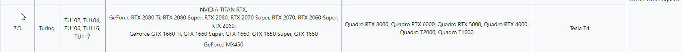
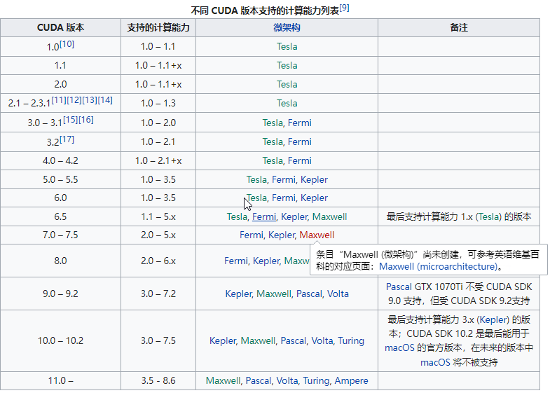

# 版本与兼容性查询
深度学习平台的环境的几个重要组成部分如`Driver`、`CUDA`、`cudnn`以及开源框架如`TensorFlow`、`Pytorch`等，有着强版本对应和适配排他性，在安装上述任何一个组件或框架之前，需确认硬件与软件的版本匹配问题，这里以`CentOS 7 64位`平台，`NVIDIA RTX 2080 Ti` 显卡为例，记录安装`CUDA 10.1` 以及` cudnn 7.6.5` 的流程。
1. GPU硬件架构与CUDA的兼容性查询
可以在[此网站](https://zh.wikipedia.org/wiki/CUDA)查询不同的`GPU架构`支持的`CUDA版本`以及`computer capability`，查询可知，`NVIDIA RTX 2080 Ti `属于 `Turing `架构，截止到目前位置，`Turing`架构可适配至`CUDA 11.0`，如下图所示：





本实例中，选择使用CUDA 10.1 与 cudnn 7.6.5 安装神队学习环境。

2. CUDA 版本与Driver版本的匹配问题
 CUDA不仅需要对硬件架构进行适配，同样需要对Driver的软件版本相匹配，版本匹配信息可以查询[官方网站](https://docs.nvidia.com/deploy/cuda-compatibility/index.html)，CUDA 10.x的Driver版本要求如下图所示:
 
 
 
 根据表中数据可知，`Linux平台`安装`CUDA 10.1` 只需要 `Driver 版本大于 418.39` 即可
 
 # 驱动安装
 详细的驱动安装流程会用单独的文档记录，这里不在赘述。
 > 注： 对于驱动版本 >= 418.39的要求，意思就是只要版本大于418.39即可，不一定刚好就是418.39才行，简单来讲，418.39-->latest都行，建议安装当前的最新版本。

# CUDA 下载与安装
## 旧版CUDA卸载
内容暂无

## CUDA下载
登录[官方网站](https://developer.nvidia.com/cuda-toolkit-archive)，选择对应的版本与平台，例如，本实例中，选择`Linux-->x86_64-->CentOS-->7-->runfile(local)`

 
 根据下方的提示，下载文件。
 ```
 wget https://developer.download.nvidia.com/compute/cuda/10.1/Prod/local_installers/cuda_10.1.243_418.87.00_linux.run
 ```
 
 ## CUDA 安装
 
 ### 安装指令
 1. 授予执行权限
    `chmod +x cuda_10.1.243_418.87.00_linux.run`
 2. 运行安装程序
    `sh cuda_10.1.243_418.87.00_linux.run`
	
### 安装中的设置
1. 选择接受协议
安装流程启动后，首先会展示用户协议，直接多次使用回车键切换到最后一行，输入`accept`,如图所示：


2. 取消勾选Driver安装
由于前面已经单独进行了driver的安装，所以在此处取消driver的安装选项


3. 在option-driver option里面勾选前两个选项


4. 点击`done`,开始安装
5. 配置环境变量
```
vim /etc/profile

export PATH=/usr/local/cuda/bin:$PATH
export LD_LIBRARY_PATH=/usr/local/cuda/lib64:$LD_LIBRARY_PATH

source /etc/profile 
```

6. 查看版本
```

[root@localhost ~]# nvcc --version

# 输出
nvcc: NVIDIA (R) Cuda compiler driver
Copyright (c) 2005-2019 NVIDIA Corporation
Built on Sun_Jul_28_19:07:16_PDT_2019
Cuda compilation tools, release 10.1, V10.1.243
```
7. 测试 CUDA Sample
编译测试demo
```
cd /root/NVIDIA_CUDA-10.1_Samples/1_Utilities/bandwidthTest
make
```

运行测试
```
./bandwidthTest --device all

# 输出
[CUDA Bandwidth Test] - Starting...

!!!!!Cumulative Bandwidth to be computed from all the devices !!!!!!

Running on...

 Device 0: NVIDIA GeForce RTX 2080 Ti
 Device 1: NVIDIA GeForce RTX 2080 Ti
 Device 2: NVIDIA GeForce RTX 2080 Ti
 Device 3: NVIDIA GeForce RTX 2080 Ti
 Quick Mode

 Host to Device Bandwidth, 4 Device(s)
 PINNED Memory Transfers
   Transfer Size (Bytes)        Bandwidth(GB/s)
   32000000                     45.9

 Device to Host Bandwidth, 4 Device(s)
 PINNED Memory Transfers
   Transfer Size (Bytes)        Bandwidth(GB/s)
   32000000                     51.1

 Device to Device Bandwidth, 4 Device(s)
 PINNED Memory Transfers
   Transfer Size (Bytes)        Bandwidth(GB/s)
   32000000                     2074.4

Result = PASS

NOTE: The CUDA Samples are not meant for performance measurements. Results may vary when GPU Boost is enabled.

# 查询更多参数与方法
./bandwidthTest --help
```

# cudnn 下载与安装
## 下载cudnn
访问[链接](https://developer.nvidia.com/rdp/cudnn-archive),选择对应CUDA版本的`cudnn`，这里选择的是对应`CUDA 10.1`版本的`cudnn 7.6.5`，文件名`cudnn-10.1-linux-x64-v7.6.5.32.tgz`

## 解压安装

```
解压压缩包
$ tar -xzvf cudnn-10.1-linux-x64-v7.6.5.32.tgz

复制文件至与cuda对应路径
$ sudo cp cuda/include/cudnn*.h /usr/local/cuda/include
$ sudo cp cuda/lib64/libcudnn* /usr/local/cuda/lib64
$ sudo chmod a+r /usr/local/cuda/include/cudnn*.h /usr/local/cuda/lib64/libcudnn*
```
## 查看cudnn版本

```
cat /usr/local/cuda/include/cudnn.h | grep CUDNN_MAJOR -A 2

# 输出
#define CUDNN_MAJOR 7
#define CUDNN_MINOR 6
#define CUDNN_PATCHLEVEL 5
--
#define CUDNN_VERSION (CUDNN_MAJOR * 1000 + CUDNN_MINOR * 100 + CUDNN_PATCHLEVEL)
```
欢迎使用 **{小书匠}(xiaoshujiang)编辑器**，您可以通过 `小书匠主按钮>模板` 里的模板管理来改变新建文章的内容。