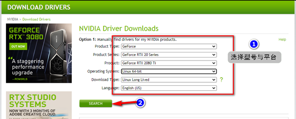
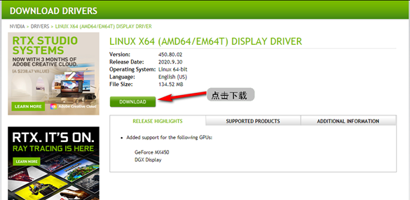
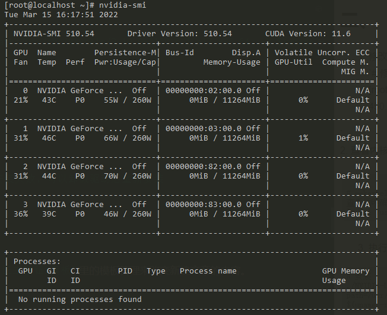

# 环境准备

## 驱动软件下载

1. 查看本地GPU型号


	键入指令查看本机所安装的设备的`GPU`型号
	```
	lspci | grep -i vga
	## 输出
	02:00.0 VGA compatible controller: NVIDIA Corporation TU102 [GeForce RTX 2080 Ti Rev. A] (rev a1)
	03:00.0 VGA compatible controller: NVIDIA Corporation TU102 [GeForce RTX 2080 Ti Rev. A] (rev a1)
	06:00.0 VGA compatible controller: ASPEED Technology, Inc. ASPEED Graphics Family (rev 30)
	82:00.0 VGA compatible controller: NVIDIA Corporation TU102 [GeForce RTX 2080 Ti Rev. A] (rev a1)
	83:00.0 VGA compatible controller: NVIDIA Corporation TU102 [GeForce RTX 2080 Ti Rev. A] (rev a1)
	```
2. 下载安装包
	在官网下载驱动安装包,[网址]( https://www.nvidia.cn/Download/index.aspx?lang=en-us ),根据上一步中的GPU类型,选择对应版本的驱动,如图1.2.1和图1.2.2所示:






## 环境预处理

1. 禁用nouveau
```
1)把驱动加入黑名单中: /etc/modprobe.d/blacklist.conf 在后面加入：
 
    blacklist nouveau
 
    options nouveau modeset=0
 
2) 使用 dracut重新建立 initramfs nouveau 并且备份 initramfs nouveau image镜像
 
    mv /boot/initramfs-$(uname -r).img /boot/initramfs-$(uname -r).img.bak
 
3) 重新建立新的 the initramfs file
 
    dracut -v /boot/initramfs-$(uname -r).img $(uname -r)
 
4)重启，检查nouveau driver确保没有被加载！
 
    reboot
 
    lsmod | grep nouveau
```

2.  修改终端模式并重启验证

	```
	# 改为终端模式，runlevel改为3
	[root@localhost ~]# systemctl set-default multi-user.target
	[root@localhost ~]# init 3

	# 重启服务器
	[root@localhost ~]# reboot
	# 重启后验证驱动是否被禁用 如果无结果显示则表明成功禁用
	[root@localhost ~]# lsmod | grep nouveau
	```

3. 查看系统内核版本
	```
	# 查看内核版本
	[root@localhost ~]# uname -r
	3.10.0-1160.el7.x86_64

	# 查看 /boot 剩余空间，最好不小于300M
	[root@localhost ~]# df -lh
	Filesystem               Size  Used Avail Use% Mounted on
	devtmpfs                 126G     0  126G   0% /dev
	tmpfs                    126G     0  126G   0% /dev/shm
	tmpfs                    126G   11M  126G   1% /run
	tmpfs                    126G     0  126G   0% /sys/fs/cgroup
	/dev/mapper/centos-root   50G   15G   36G  29% /
	/dev/sda2               1014M  187M  828M  19% /boot
	/dev/sda1                200M   12M  189M   6% /boot/efi
	/dev/mapper/centos-home  876G   14G  863G   2% /home
	```
4. 安装环境组件与依赖
	```
	# 安装组件
	[root@localhost ~]# yum install gcc kernel-devel kernel-headers
	
		yum install gcc kernel-devel-$(uname -r) kernel-headers
	```
	
# 安装驱动
1. 修改文件执行权限
   `# 修改文件权限
	[root@localhost ~]# chmod +x NVIDIA-Linux-x86_64-450.80.02.run
	`
2. 查看内核
	  ```   
	# --kernel-source-path使用本机地址，可在/usr/src/kernels 查看后明确本地地址
	ls -al /usr/src/kernels
	```
3. 执行安装
	 ```
	 # 安装
	./NVIDIA-Linux-x86_64-450.80.02.run --kernel-source-path=/usr/src/kernels/3.10.0-1160.6.1.el7.x86_64  -k $(uname -r)
	 ```
 
 4. 安装验证
	 ```
	 # 查看GPU相关配置
	[root@localhost ~]# nvidia-smi
	# 如果正常显示安装的显卡信息，则说明驱动安装成功； 
	# 如果提示找不到该指令，或什么信息都没有显示，则驱动安装失败，可以卸载驱动后重新安装

	[root@localhost ~]# nvidia-smi
	Tue Mar 15 16:17:51 2022

	 ```
 
欢迎使用 **{小书匠}(xiaoshujiang)编辑器**，您可以通过 `小书匠主按钮>模板` 里的模板管理来改变新建文章的内容。