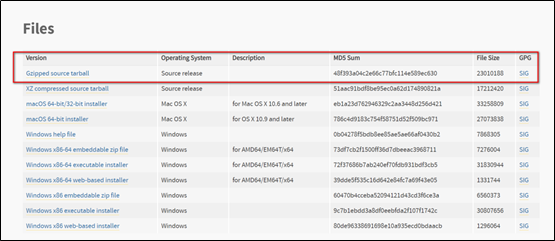

# 查看当前环境的Python版本
操作系统安装完成后，检查自带的`python`环境，分别使用`python --version` 和 `whereis python`指令查看`python`版本和安装位置：
```
[root@localhost ~]# python2 --version
Python 2.7.5
[root@localhost ~]# whereis python
python: /usr/bin/python  /usr/bin/python2.7   /usr/lib/python2.7  /usr/lib64/python2.7  /etc/python  /usr/include/python2.7  /usr/share/man/man1/python.1.gz
```
由指令结果可知，`python`原始版本为 `2.7.5`，安装位置为`/usr/bin`

# 下载python3安装包
本实例使用的python版本是3.6.8，因此，需要从官方网站下载对应版本对应平台的安装包，[下载链接](https://www.python.org/downloads/release/python-368/)：选择源码下载，如图所示：

或可直接使用linux指令下载，如下所示：
```
wget https://www.python.org/ftp/python/3.6.8/Python-3.6.8.tgz
或
curl -O https://www.python.org/ftp/python/3.6.8/Python-3.6.8.tgz
```
# 安装python3
无论以上述何种方式，下载文件，将文件保存在linux系统某一位置，并解压,首先安装相应的工具和依赖后，进入文件夹中进行安装，操作指令如下所示：
```
# 解压
[root@localhost ~]# tar xzvf Python-3.6.8.tgz
# 使用yum安装必要的工具
[root@localhost ~]#   yum install yum-utils
# 构建python依赖环境
[root@localhost ~]#  yum-builddep python
# 进入文件夹
[root@localhost ~]# cd Python3.6.8
# 运行配置，默认安装位置为/usr/local/bin/,改变使用--prefix=/alternative/path，建议使用默认配置
[root@localhost ~]# ./configure
# 编译  
[root@localhost ~]#  make
# 安装
[root@localhost ~]#  make install
```

至此，已经在CentOS系统中成功安装了`python3`、`pip3`、`setuptools`
查看`python`版本和安装位置：`python2 `和 `python3 `两个版本共存
```
[root@localhost ~]# python3 --version
Python 3.6.8

[root@localhost ~]# whereis python
python: /usr/bin/python /usr/bin/python2.7 /usr/lib/python2.7 /usr/lib64/python2.7 /etc/python /usr/local/bin/python3.6m /usr/local/bin/python3.6 /usr/local/bin/python3.6m-config /usr/local/bin/python3.6-config /usr/local/lib/python3.6 /usr/include/python2.7 /usr/share/man/man1/python.1.gz
```
# 更换系统默认python版本
由于原`python2`版本在`/usr/bin/` 目录下，使用软连接`python-->pyhton2-->pyhton2.7`,是的默认`python`解释器的位置指向`python2`，所以此处只需修改`python`和`pip`的软连接即可：
```
# 进入 /usr/bin 目录
[root@localhost ~]# cd /usr/bin

# 删除指向python2 的软连接
[root@localhost ~]# rm -rf python

# 重新建立python3和pip3的软连接，此实例安装位置为/usr/local/bin/,如安装位置不同，请切换
[root@localhost ~]# ln -sv /usr/local/bin/python3   /usr/bin/python
[root@localhost ~]# ln -sv /usr/local/bin/pip3   /usr/bin/pip
```

此时，若使用`python2`版本，需键入`python2`.使用`python3`版本，需键入`python`。
> 注意事项：不要使用配置alias的方式配置默认python环境，否则在使用虚拟环境时，会导致在虚拟环境中使用的解释器依然是外部环境

# 修改yum配置文件的Python引用
因为`yum`使用的是`python2.7`，修改了`python`软连接，需修改配置文件，
 ```
 [root@localhost ~]#  vim   /usr/bin/yum
# 把文件头部的   #!/usr/bin/python   改成    #!/usr/bin/python2.7

[root@localhost ~]#  vim /usr/libexec/urlgrabber-ext-down
# 把文件头部的   #!/usr/bin/python   改成    #!/usr/bin/python2.7

[root@localhost ~]#  vim /usr/bin/yum-config-manager
# 把文件头部的   #!/usr/bin/python   改成    #!/usr/bin/python2.7
 ```
`Python 3`环境安装与默认版本配置完成。

欢迎使用 **{小书匠}(xiaoshujiang)编辑器**，您可以通过 `小书匠主按钮>模板` 里的模板管理来改变新建文章的内容。