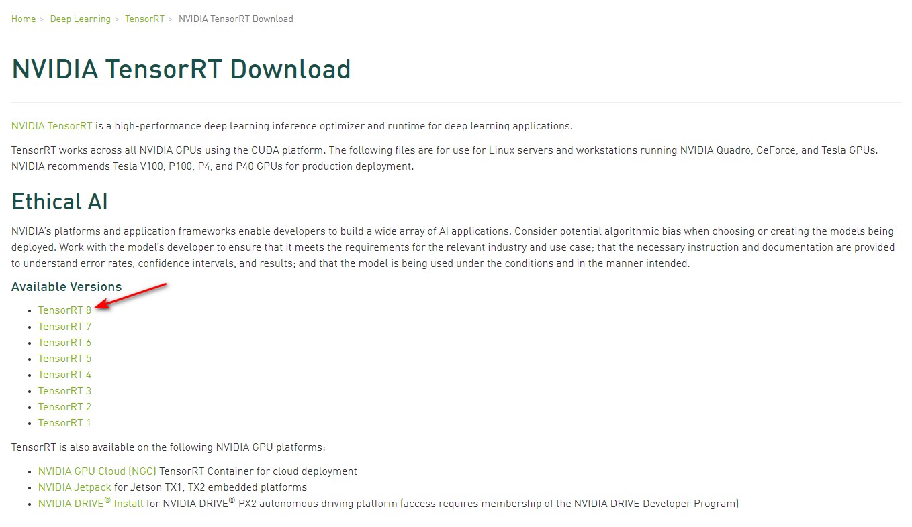
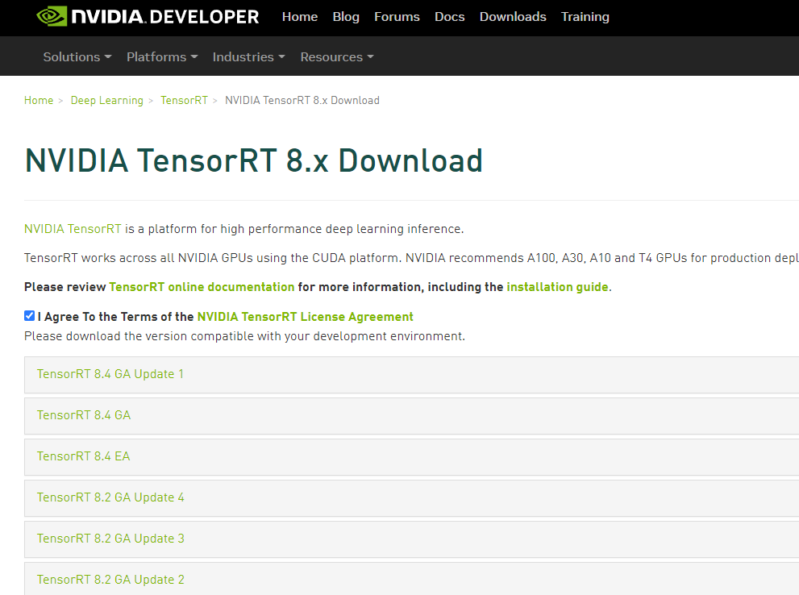
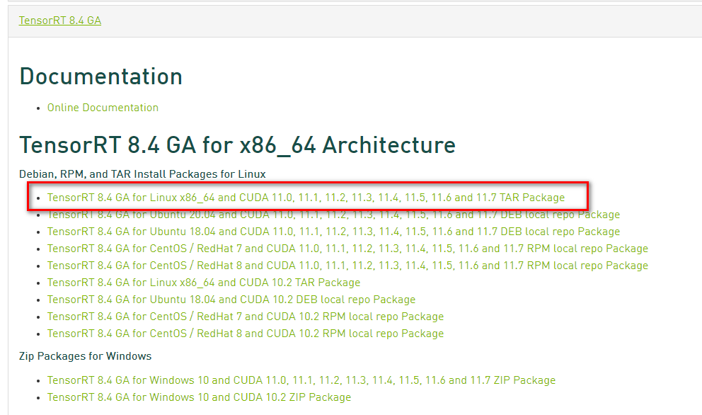
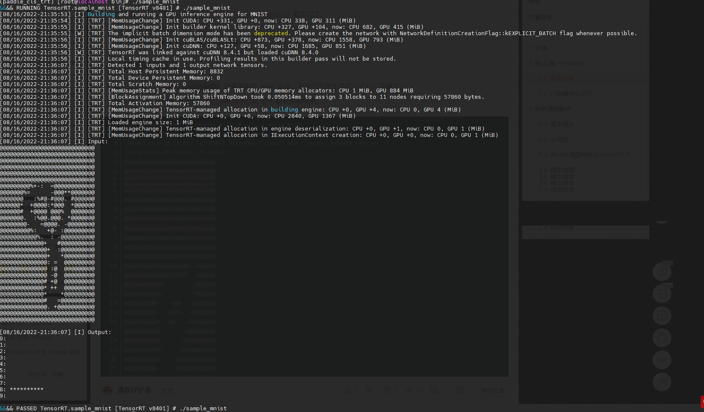

# 概述

`NVIDIA` `TensorRT`的核心是一个`c++`库，用于在`NVIDIA`图形处理单元(`gpu`)上进行高性能模型推理。`TensorRT`将包括网络定义和一组经过训练的参数的神经网络转换为一个高度优化的运行时引擎，对该网络进行推理。

`TensorRT`提供i可供`c++`和`Python`调用的`API`，这些高级语言接口可表达通过网络定义接口的深度学习模型，或通过解析器加载预定义的模型，允许`TensorRT`优化并在`NVIDIA ``GPU`上运行这些网络模型。`TensorRT`应用了`图优化`、`层融合`以及其他优化，同时还利用各种高度优化的内核找到了该模型的最快实现。`TensorRT`还提供了一个`runtime`，你可以使用它在`NVIDIA Kepler`(**NVIDIA的显卡架构**)之后的所有`GPU`上执行这个网络。

`TensorRT`还包括`NVIDIA Pascal`，`NVIDIA Volta`，`NVIDIA Turing`和`NVIDIA Ampere`等架构的可选高速混合精度计算能力能力与。

# CentOS系统安装TRT
## 环境与准备
1. 记录一下本博文编辑时，安装TensorRT的机器环境：

	- 显卡型号: `NVIDIA RTX 3070`
	- 操作系统: `CentOS 7 x64`
	- `NVIDIA`版本: `Latest`
	- `CUDA`版本: `cuda_11.6.2_510.47.03_linux`
	- `cuDNN`版本: `cudnn-linux-x86_64-8.4.0.27_cuda11.6`

> 本篇博文**仅记录**`TensorRT`的安装，故上述中的`NVIDIA Driver`、`CUDA`、`cuDNN`都已经完整并正确的安装，安装步骤不再赘述

2. 下载`TensorRT`安装包，这里使用的是`tar`类型的安装包
	[官方下载网站](https://developer.nvidia.com/nvidia-tensorrt-download)，首次登录可能需要使用`NVIDIA`账号登录,选择合适的版本点击，这里选择的`TensorRT 8`,进入下载页面后，勾选`I Agree To The Terms of NVIDIA TensorRT License Agrrement`,点击`TensorRT 8.4 GA`，选择 `TAR Package`
	
	
	
	
	
	
	
OK ! 准备工作已完成。

## 安装
1. 文件名与路径
	下载完成后的`tar`文件名为`TensorRT-8.4.1.5.Linux.x86_64-gnu.cuda-11.6.cudnn8.4.tar.gz`,解压后后文件夹名为`TensorRT-8.4.1.5`,绝对路径是`/usr/local/TensorRT-8.4.1.5`
	> 注: 这里的文件路径非强制性规定，自定义解压路径即可

2. 使用ls指令查看文件内容

	```
	ls TensorRT-8.4.1.5
	bin  data  doc  graphsurgeon  include  lib  onnx_graphsurgeon  python  samples  targets  uff
	```
	
3. 配置环境变量,在`~/.bashrc` 或`/etc/profile`写入以下配置

	```
	export LD_LIBRARY_PATH=$LD_LIBRARY_PATH:/usr/local/TensorRT-8.4.1.5/lib
	```
	> 关于写入`~/.bashrc` 和 `/etc/profile`的区别，请查询相关资料，这里不再赘述
	> 写入`~/.bashrc`后请执行`source ~/.bashrc`使之生效
	> 同理，具体路径以实际为准，取决于您机器的`TensorRT`的放置位置

4. 安装TensorRT wheel 文件(区分Python版本)
	```
	cd TensorRT-8.4.1.5/python
	python3 -m pip install tensorrt-*-cp3x-none-linux_x86_64.whl
	```
5. 安装Python UFF wheel 文件. 此步骤仅在同时使用TensorFlow和TensorRT执行
	```
	cd TensorRT-8.4.1.5/uff
	python3 -m pip install uff-0.6.9-py2.py3-none-any.whl
	
	# 校验安装情况
	which convert-to-uff
	```

6. 安装Python graphsurgeon wheel 文件.
	```
	cd TensorRT-8.4.1.5/graphsurgeon
	python3 -m pip install graphsurgeon-0.4.6-py2.py3-none-any.whl
	```
7. 安装Python onnx-graphsurgeon wheel 文件.
	```
	cd TensorRT-8.4.1.5/onnx_graphsurgeon
	python3 -m pip install onnx_graphsurgeon-0.3.12-py2.py3-none-any.whl
	```

>注:  第4-7`安装wheel文件`的步骤建议在已经安装Python虚拟环境后执行
>注:  第4步`安装TensorRT wheel文件`时，需要根据当前的`Python版本`选择合适的wheel文件

## 校验
1. 数据准备
	```
	cd /usr/local/TensorRT-8.4.1.5/data/minst
	# 当前版本已有pgm数据则跳过下面指令，否则运行脚本下载数据
	python generate_pgms.py
	```
	
2. 编译示例源码
	```
	cd /usr/local/TensorRT-8.4.1.5/samples/sampleMNIST
	yum install g++ gcc-c++ cmake gcc -y
	make -j4
	```
3. 运行示例
	```
	cd /usr/local/TensorRT-8.4.1.5/bin
	
	./sample_mnist
	```
	效果图如下：
	
	
	
	
至此，`CentOS`系统安装`TensorRT`环境，完成！

# 参考链接
- https://docs.nvidia.com/deeplearning/tensorrt/install-guide/index.html#installing-tar
- https://blog.csdn.net/irving512/article/details/107165757


欢迎使用 **{小书匠}(xiaoshujiang)编辑器**，您可以通过 `小书匠主按钮>模板` 里的模板管理来改变新建文章的内容。