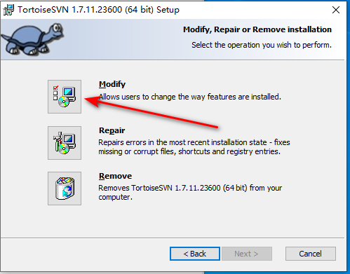
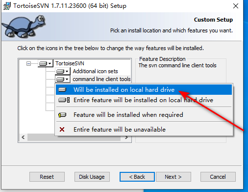
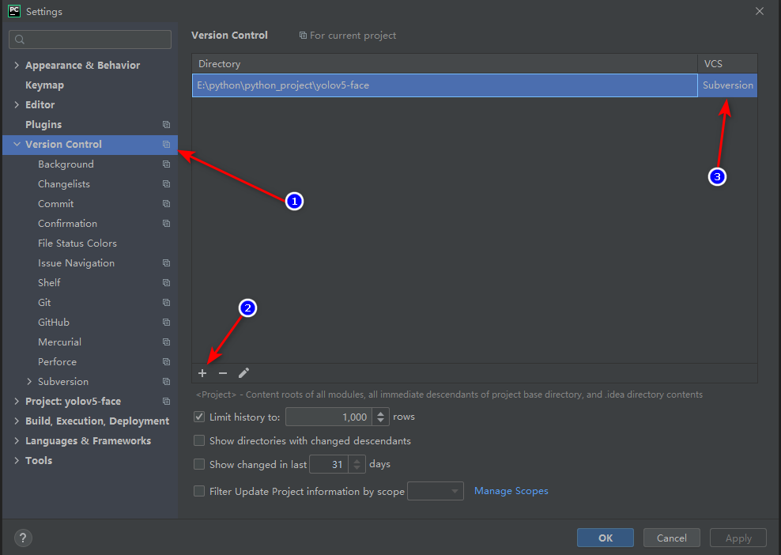
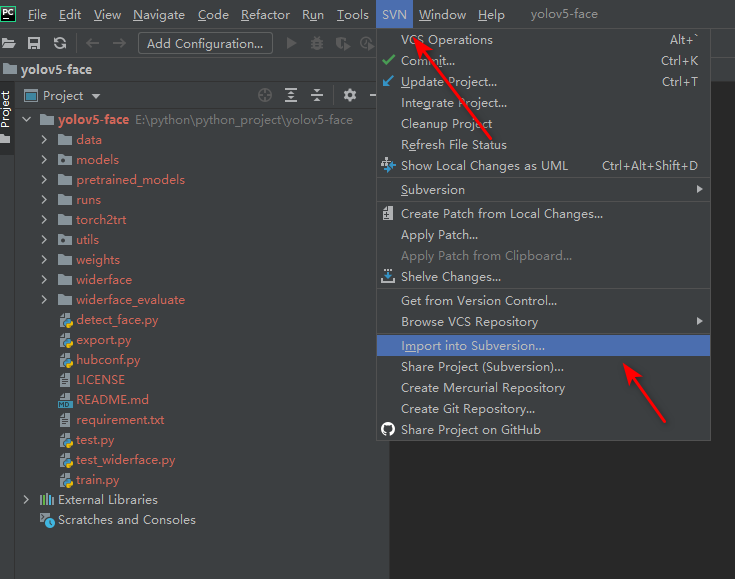
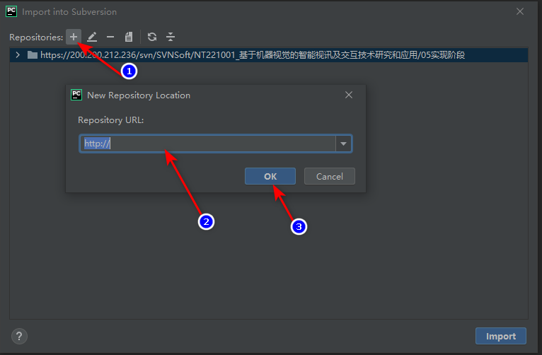
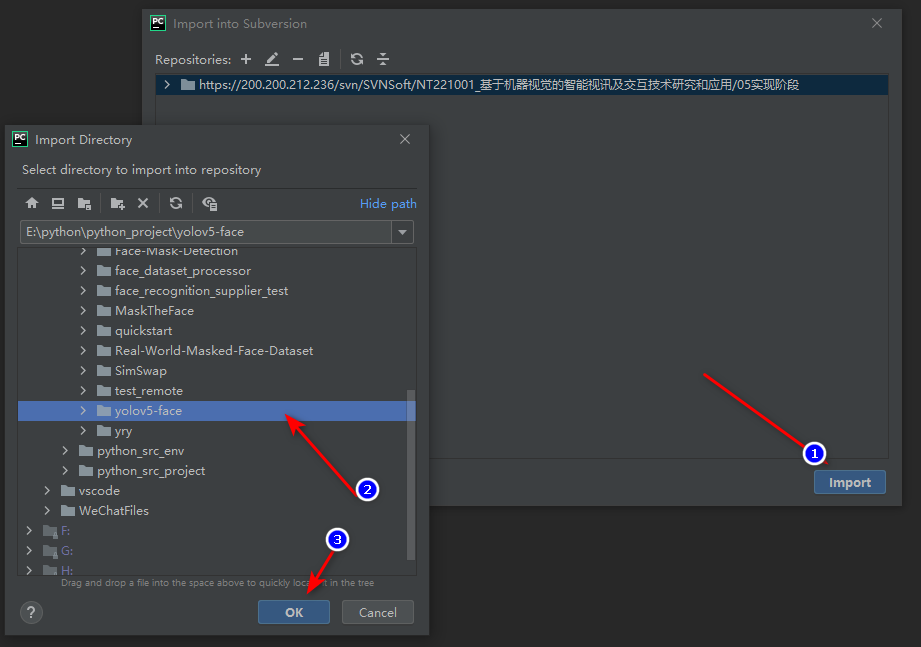
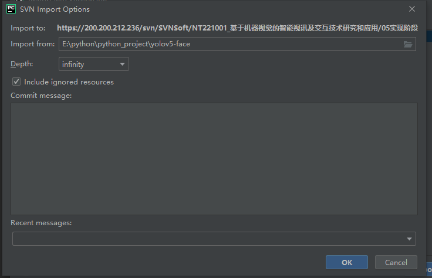

## SVN Command Line Tool的安装

## Pycharm配置SVN

1. 打开Pycharm，按照路径`File-->Settings-->Version Control`进入设置选项，添加版本控制仓库，`VCS`工具选择`Subversion`

	

2. 此时，导航栏会出现`SVN`选项，点击选择`Import into Subversion`

	

3. 新增SVN仓库地址，并选中该地址

	
	
4. 点击`Import`,选择导入的项目

	
	   
	   
5. 填写必要的提交信息，点击`OK`即可提交
	
	
	
> 注： 提交代码前请确认所属账号有对应SVN目录的`读写权限`，否则会造成`Authentication错误`

欢迎使用 **{小书匠}(xiaoshujiang)编辑器**，您可以通过 `小书匠主按钮>模板` 里的模板管理来改变新建文章的内容。