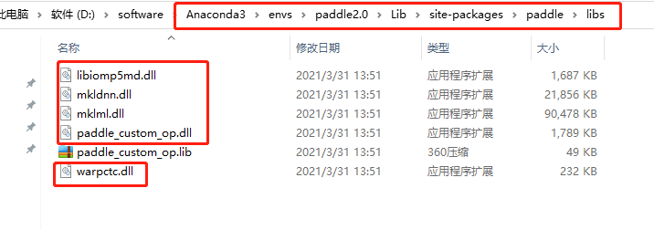
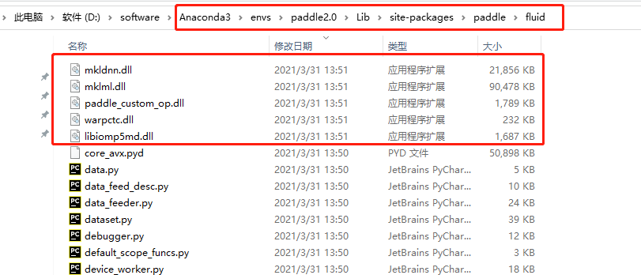

# 概述
百度飞桨深度学习框架`PaddlePaddle`支持使用`TensorRT`加速，本文主要记录其环境安装的流程。

# 安装方法
## 硬件要求
- 设备已安装主流`NVIDIA`显卡(`GeForce` `Quadro` `Tesla`等系列)
 
 ## 软件要求
 - 已安装显卡驱动(`NVIDIA Driver`)
 - 已正确安装`CUDA`和`cuDNN`
 - 已正确安装`TensorRT`
 - 已安装`Python`环境或`Conda`虚拟环境管理工具

> 注 : **正确安装**表示所有软件环境的版本满足适配要求

> 注:  关于`CUDA`和`cuDNN`以及`TensorRT`的版本，可结合推理或训练的需求去适配

## 创建虚拟环境
使用虚拟环境管理工具创建虚拟环境，指定`python`版本，此处记虚拟环境名称为`paddle_trt`,`python`版本为`3.8`
```
# 创建虚拟环境
conda create -n paddle_trt python=3.8 -y
# 激活虚拟环境(下文中除特殊指定外，指令均在虚拟环境中执行)
conda activate paddle_trt
```

## 安装`TensorRT`环境依赖
分别安装`TensorRT`提供的预编译`whl`依赖文件，以安装位置为`/usr/local/TensorRT-8.4.3.1`为例，安装目录结构如下：

	```
	TensorRT-8.4.3.1
	|
	|
	|-- bin -> targets/x86_64-linux-gnu/bin
	|-- data
	|-- doc
	|-- graphsurgeon
	|-- include
	|-- lib -> targets/x86_64-linux-gnu/lib
	|-- onnx_graphsurgeon
	|-- python
	|-- samples
	|-- targets
	|-- uff
	```
	
依次安装以下依赖即可:
```
cd /usr/local/TensorRT-8.4.3.1
pip install python/tensorrt-8.4.3.1-cp38-none-linux_x86_64.whl
pip install uff/uff-0.6.9-py2.py3-none-any.whl
pip install onnx_graphsurgeon/onnx_graphsurgeon-0.3.12-py2.py3-none-any.whl
```

## 安装PaddlePaddle

百度官方文档[链接](https://www.paddlepaddle.org.cn/install/quick)所提供的在线安装方法暂不支持`TensorRT`加速，但提供了支持TensorRT加速的预编译文件，[下载链接](https://paddleinference.paddlepaddle.org.cn/master/user_guides/download_lib.html#python)，选择对应平台与依赖版本的`whl`文件下载后使用`pip`指令指定文件即可安装。

> 注 :  选择`whl`文件一定要注意**平台与版本匹配**

> 注 : 如果需要在已安装Paddle的虚拟环境而不是新建的虚拟环境，需先卸载`paddlepaddle`或`paddlepaddle-gpu` 

## 环境校验

使用`paddle`的`API`校验环境安装情况，如下所示:
```
python -c "import paddle;paddle.utils.run_check()"
# 输出结果如下:
Running verify PaddlePaddle program ...
W0301 16:38:52.164366 14875 gpu_resources.cc:61] Please NOTE: device: 0, GPU Compute Capability: 8.6, Driver API Version: 11.7, Runtime API Version: 11.2
W0301 16:38:52.167099 14875 gpu_resources.cc:91] device: 0, cuDNN Version: 8.2.
PaddlePaddle works well on 1 GPU.
PaddlePaddle works well on 1 GPUs.
PaddlePaddle is installed successfully! Let's start deep learning with PaddlePaddle now.
```

## 异常问题及解决方法

### `from . core_avx import * 找不到指定模块`

详细报错信息 ：
```
Error: Can not import avx core while this file exists: xxxxxx(Python的虚拟环境路径)\paddle2.0\lib\site-packages\paddle\fluid\core_avx.pyd
```
原因：在`fluid`文件夹下找不到`core_avx`对应的`DLL`

解决方法：

1. 先找到对应的`dll`

	进入虚拟环境paddle_trt保存路径下，如下图所示，找到`paddle/libs`文件夹，如下所示：
	

	2.  将`xxx/paddle/libs`文件下的`dll`（如上图所示标红的`dll`)拷贝到虚拟环境`xxx/paddle/fluid`文件夹下：

	拷贝之后如下图所示：
	
	
	> 注 ：图片中的路径仅供参考


# 参考链接
- 百度官方安装文档[链接](https://www.paddlepaddle.org.cn/install/quick)
- 百度官方whl文件[链接](https://paddleinference.paddlepaddle.org.cn/master/user_guides/download_lib.html#python)
- [CSDN][（from . core_avx import * 找不到指定模块）](https://blog.csdn.net/u010674979/article/details/117224889)


欢迎使用 **{小书匠}(xiaoshujiang)编辑器**，您可以通过 `小书匠主按钮>模板` 里的模板管理来改变新建文章的内容。