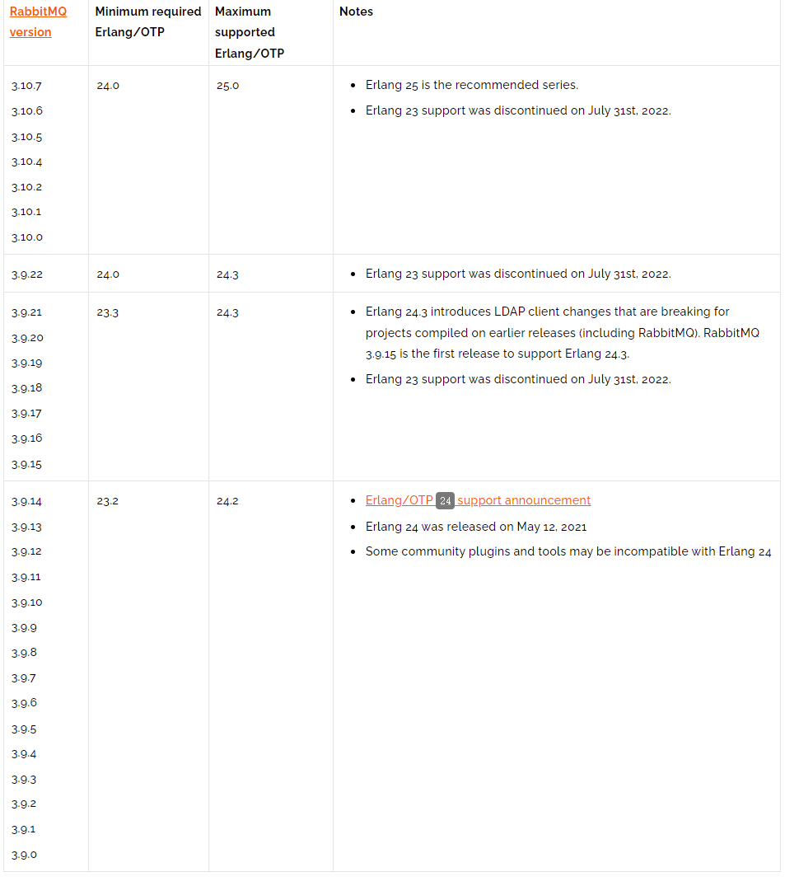
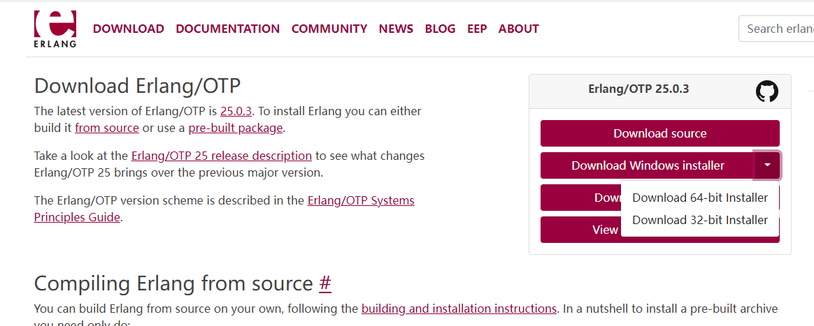
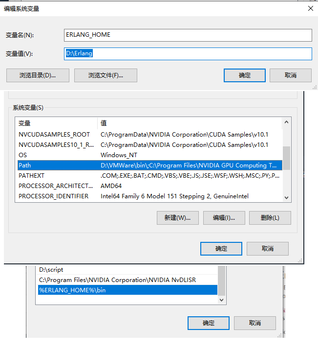
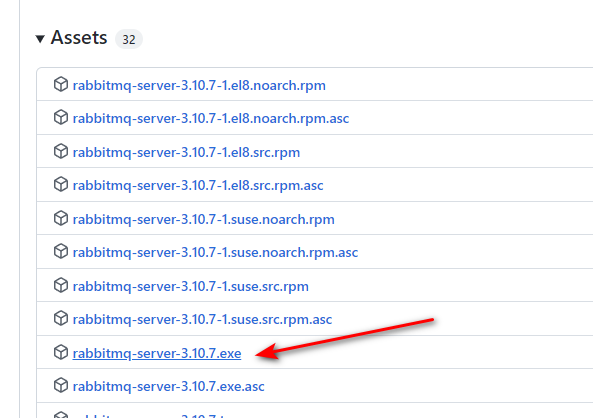
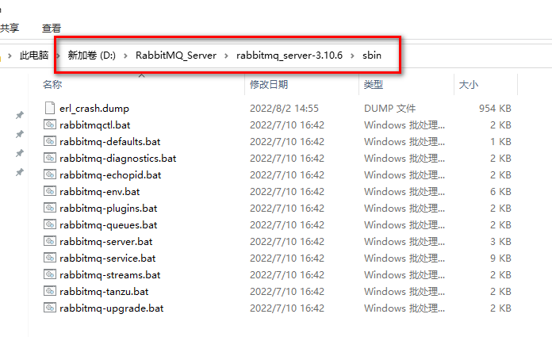
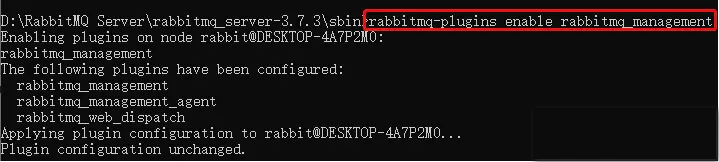
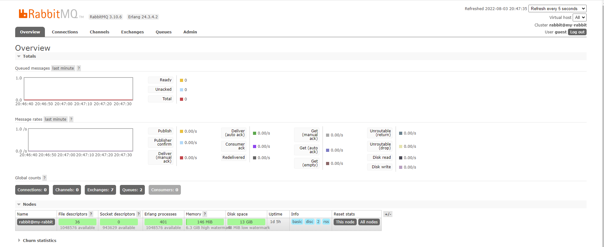

[TOC]
# 概述
`RabbitMQ`是一款使用`Erlang`语言开发的，实现`AMQP`(高级消息队列协议)的开源消息中间件.

由于`RabbitMQ`是基于`Erlang`语言开发，所以在安装`RabbitMQ`之前, 需要先安装`Erlang`环境依赖；
`RabbitMQ`和`Erlang`版本对应关系，可以参考[官网](https://www.rabbitmq.com/which-erlang.html)给出的列表，预览如下：



# 环境部署
## Erlang依赖的安装
[官方网站](http://www.erlang.org/downloads)下载对应平台的安装包，这里选择Windows 64位的安装包，如图所示:



安装包下载完成后，双击启动安装流程，确认`next`直至安装结束.

配置环境变量，如下图所示：



使用命令行工具验证安装:
```
C:\Users\lujx> erl -version
Erlang (SMP,ASYNC_THREADS) (BEAM) emulator version 13.0.3
```
## 部署RabbitMQ服务
在github[官方页面](https://github.com/rabbitmq/rabbitmq-server/releases/tag/v3.10.7)下载windows平台安装包,如下图



下载完成后，双击安装至结束即可。

## 插件与功能管理
### 开启后台管理界面插件功能
安装完成后找到安装目录，在此目录下打开`cmd`命令，输入`rabbitmq-plugins enable rabbitmq_management`命令安装管理页面的插件





然后双击`rabbitmq-server.bat`启动脚本，然后打开服务管理可以看到`RabbitMQ`正在运行
这时，打开浏览器输入`http://localhost:15672`，账号密码默认是：`guest`/`guest`


登录首页：


### 前端消息订阅插件功能开启(stomp协议通道,15674端口)
安装完成后找到安装目录，在此目录下打开`cmd`命令，输入`rabbitmq-plugins enable rabbitmq_web_stomp`命令启用管理页面的插件

指令如下:
	```
	rabbitmq-plugins enable rabbitmq_web_stomp
	```

# 关于启动报错的解决方法

`rabbitmq`服务有时会启动失败，在双击`rabbitmq-server.bat`重新启动后，会因为后台有`erlsrv.exe`和`erl.exe`两个进行仍在运行导致启动失败和闪退现象.
解决方法: 
1. 使用管理员权限关闭`erlsrv.exe`和`erl.exe`两个服务进程
2. 重新调用`rabbitmq-server.bat`脚本启动服务，将相关操作步骤整理为`bat`脚本，内容如下：
   > 注：执行脚本前，需要将脚本的地址添加到`PATH`环境变量中
```cmd
@echo off
REM =========================================获取管理员权限=========================================

>nul 2>&1 "%SYSTEMROOT%\system32\cacls.exe" "%SYSTEMROOT%\system32\config\system"
if \'%errorlevel%\' NEQ \'0\' (
goto UACPrompt
) else ( goto gotAdmin )

:UACPrompt
echo Set UAC = CreateObject^("Shell.Application"^) > "%temp%\getadmin.vbs"
echo UAC.ShellExecute "%~s0", "", "", "runas", 1 >> "%temp%\getadmin.vbs"

"%temp%\getadmin.vbs"
exit /B

:gotAdmin

if exist "%temp%\getadmin.vbs" ( del "%temp%\getadmin.vbs" )
cd /d "%~dp0"
REM =========================================获取管理员权限=========================================


REM ======kill the pre-initiated process======
taskkill /im erlsrv.exe /f /t 
taskkill /im erl.exe /f /t

REM ======start rabbitmq service by calling start-server bat file======
REM ======make sure you set the absolute path of bat file to PATH variable======

call rabbitmq-server -detached
```
# 参考链接
- `https://juejin.cn/post/6854573219253485575`
- https://www.erlang.org/downloads
- https://github.com/rabbitmq/rabbitmq-server/releases/tag/v3.10.6
欢迎使用 **{小书匠}(xiaoshujiang)编辑器**，您可以通过 `小书匠主按钮>模板` 里的模板管理来改变新建文章的内容。