# 概述

`NVIDIA` `TensorRT`的核心是一个`c++`库，用于在`NVIDIA`图形处理单元(`gpu`)上进行高性能模型推理。`TensorRT`将包括网络定义和一组经过训练的参数的神经网络转换为一个高度优化的运行时引擎，对该网络进行推理。

`TensorRT`提供i可供`c++`和`Python`调用的`API`，这些高级语言接口可表达通过网络定义接口的深度学习模型，或通过解析器加载预定义的模型，允许`TensorRT`优化并在`NVIDIA ``GPU`上运行这些网络模型。`TensorRT`应用了`图优化`、`层融合`以及其他优化，同时还利用各种高度优化的内核找到了该模型的最快实现。`TensorRT`还提供了一个`runtime`，你可以使用它在`NVIDIA Kepler`(**NVIDIA的显卡架构**)之后的所有`GPU`上执行这个网络。

`TensorRT`还包括`NVIDIA Pascal`，`NVIDIA Volta`，`NVIDIA Turing`和`NVIDIA Ampere`等架构的可选高速混合精度计算能力能力与。


# Windows系统安装TRT
## 环境准备
1. 记录一下本博文编辑时，安装TensorRT的机器环境：

	- 显卡型号: `NVIDIA GTX 1660 SUPER`
	- 操作系统: `Windows 10`
	- `NVIDIA`版本: `Latest`
	- `CUDA`版本: `cuda_10.1`
	- `cuDNN`版本: `cudnn 7.6.5`

> 本篇博文**仅记录**`TensorRT`的安装，故上述中的`NVIDIA Driver`、`CUDA`、`cuDNN`都已经完整并正确的安装，安装步骤不再赘述

2. 下载`TensorRT`安装包，这里使用的是`zip`类型的安装包
	[官方下载网站](https://developer.nvidia.com/nvidia-tensorrt-download)，首次登录可能需要使用`NVIDIA`账号登录,选择合适的版本点击，这里选择的`TensorRT 6`,进入下载页面后，勾选`I Agree To The Terms of NVIDIA TensorRT License Agrrement`,点击`TensorRT 6.0 GA`，选择 `zip package`
	
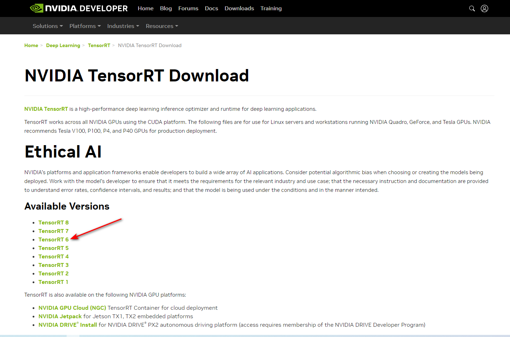
	

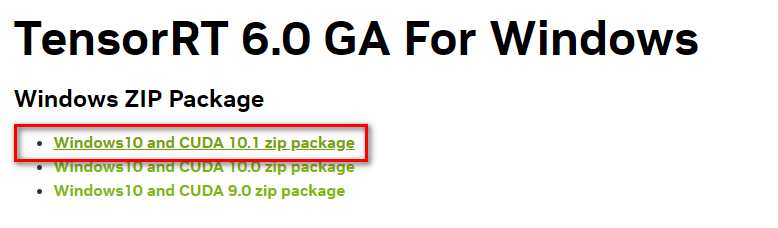
	
OK ! 准备工作已完成。

## 安装配置

### 解压安装包，配置环境变量
本示例中，下载的安装包文件名为`TensorRT-6.0.1.5.Windows10.x86_64.cuda-10.1.cudnn7.6.zip`,将安装包解压后放置于合适的安装目录，例如，`d:\TensorRT-6.0.1.5`,配置环境变量`PATH`,添加`TensorRT`的`bin`文件路径，`d:\TensorRT-6.0.1.5\bin`,如下图所示:

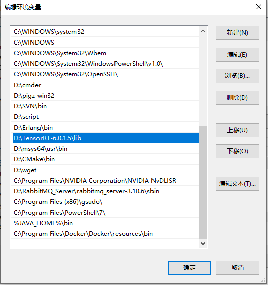

> 注 :  请确认与PATH同级的CUDA的环境变量，本实例中，分别为`CUDA_PATH`和`CUDA_PATH_V10.1`,上述两个环境变量在安装CUDA时一般会自动生成，如果没有自动生成，手动添加即可。可参考以下数据，将路径替换为实际路径即可: 
> `CUDA_PATH` = `C:\Program Files\NVIDIA GPU Computing Toolkit\CUDA\v10.1`
> `CUDA_PATH_V10.1` = `C:\Program Files\NVIDIA GPU Computing Toolkit\CUDA\v10.1`

### 复制头文件与引用文件

1. 将`TensorRT-6.0.1.5\include`中 `.h` 文件**复制**到`%CUDA_PATH%\include`,即上文中的`C:\Program Files\NVIDIA GPU Computing Toolkit\CUDA\v10.1\include`
2. 将`TensorRT-6.0.1.5\lib`中所有`.lib`文件**复制**到`%CUDA_PATH%\lib\x64`, 即上文中的`C:\Program Files\NVIDIA GPU Computing Toolkit\CUDA\v10.1\lib\x64`
3. 将`TensorRT-6.0.1.5\lib`中所有`.dll`文件**复制**到`%CUDA_PATH%\bin`,即上文中的 `C:\Program Files\NVIDIA GPU Computing
Toolkit\CUDA\v10.1\bin`

### 虚拟环境安装`graphsurgeon`和`uff`
激活或新建一个需要使用`TensorRT`的`虚拟环境`，切换目录到`d:\TensorRT-6.0.1.5`,分别安装已经编译完成的`whl`文件,如下所示：
```
pip install .\graphsurgeon\graphsurgeon-0.4.1-py2.py3-none-any.whl
pip install .\uff\uff-0.6.5-py2.py3-none-any.whl
```

## 运行示例Demo

使用`VS 2017`打开示例文件，文件路径 : `D:\TensorRT-6.0.1.5\samples\sampleMNIST\sample_mnist.sln`,右键项目名称选择`属性`,如下图所示:

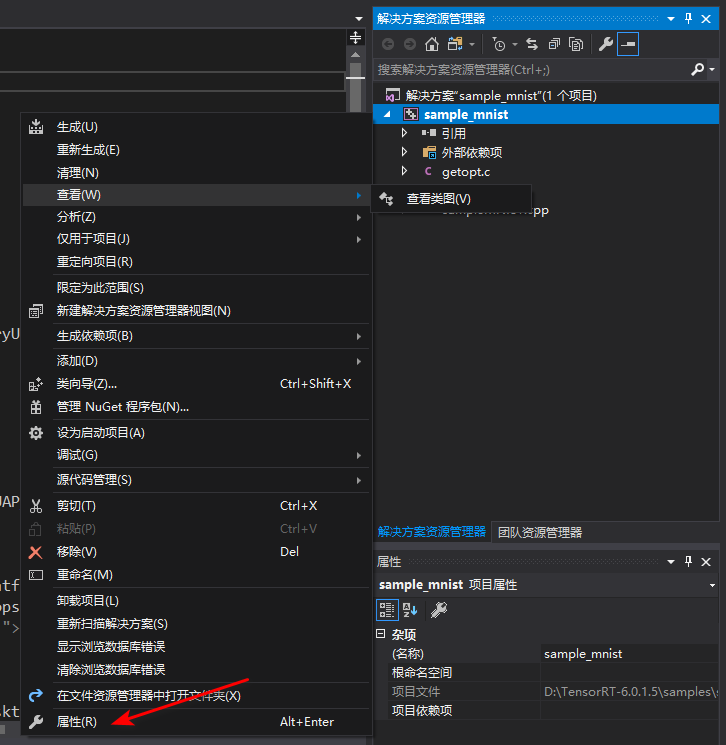

1. `常规`选项，检查下图中红色箭头指向的位置：

	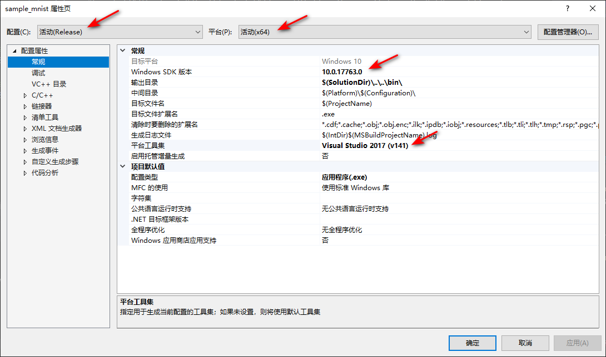

2. `VC++`选项，分别配置`可执行文件目录`添加`D:\TensorRT-6.0.1.5\bin`,`包含目录`添加`%CUDA_PATH%\include`,`库目录`添加`%CUDA_PATH%\lib\x64`,如下列图形所示：

	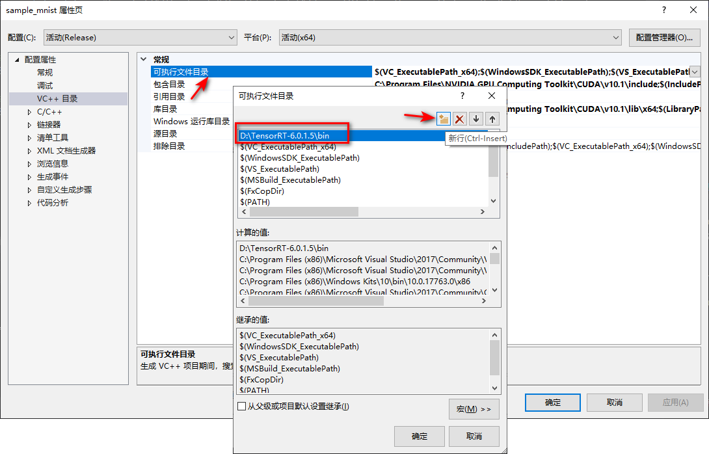

	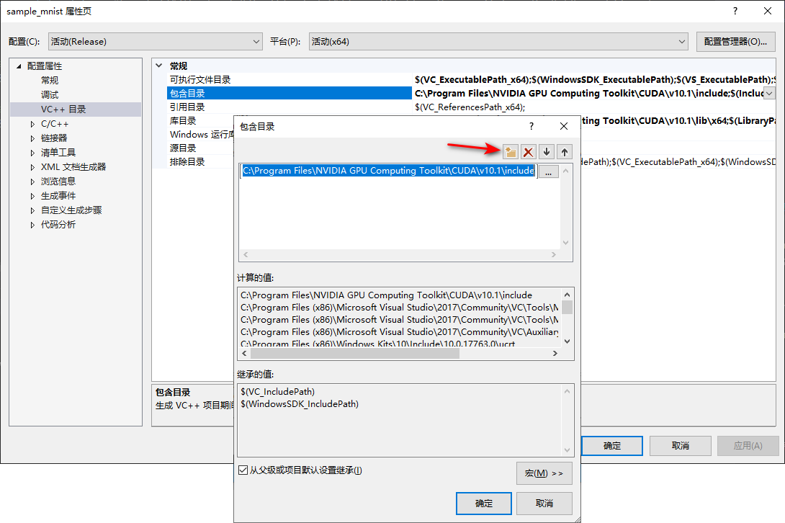

	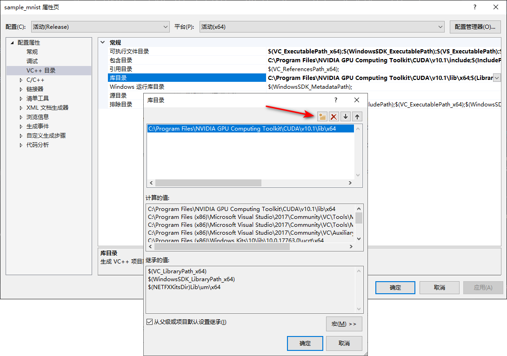
3. `C/C++`-->`常规`选项， 配置`附加包含目录`添加`D:\TensorRT-6.0.1.5\bin`，如图所示：

	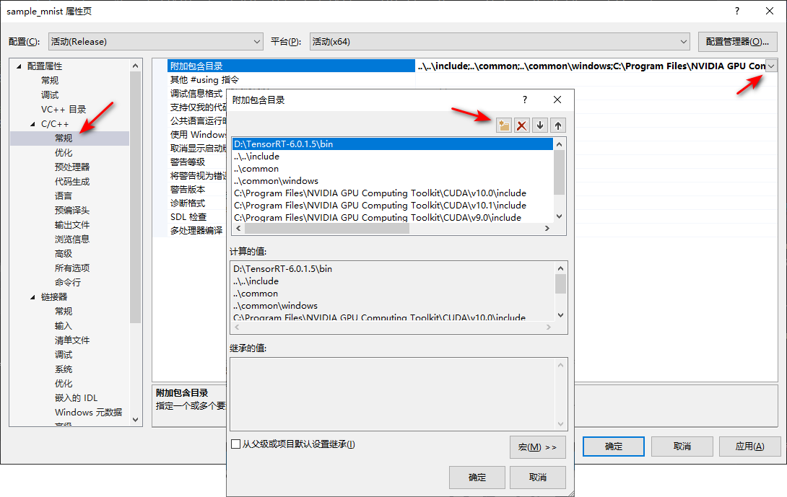

4. `链接器`-->`输入`选项，配置`附加依赖项`，添加以下信息：

	```
	cublas.lib
	cuda.lib
	cudadevrt.lib
	cudart.lib
	cudart_static.lib
	```

	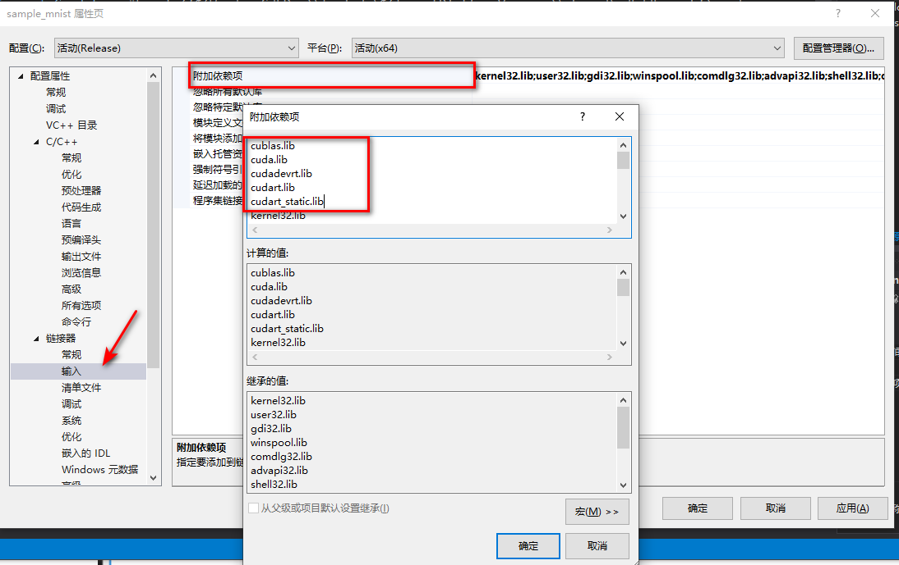
5. 右键`重新生成`,根据日志信息，无报错即可

	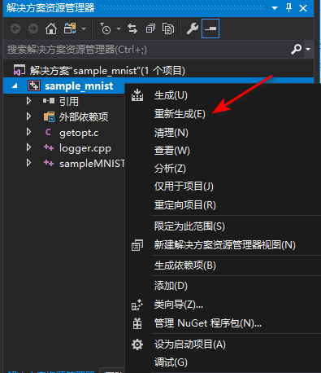
	```
	1>------ 已启动全部重新生成: 项目: sample_mnist, 配置: Release x64 ------
	1>sampleMNIST.cpp
	1>logger.cpp
	1>正在生成代码...
	1>getopt.c
	1>sample_mnist.vcxproj -> D:\TensorRT-6.0.1.5\samples\sampleMNIST\\..\..\bin\sample_mnist.exe
	========== 全部重新生成: 成功 1 个，失败 0 个，跳过 0 个 ==========
	```

6. 运行demo

切换目录到`D:\TensorRT-6.0.1.5\bin`,运行`sample_mnist.exe`,运行结果如下所示：
```
D:\..\bin> .\sample_mnist.exe
&&&& RUNNING TensorRT.sample_mnist # D:\TensorRT-6.0.1.5\bin\sample_mnist.exe
[00/10/2023-11:34:15] [I] Building and running a GPU inference engine for MNIST
[00/10/2023-11:34:16] [W] [TRT] TensorRT was linked against cuBLAS 10.2.0 but loaded cuBLAS 10.1.0
[00/10/2023-11:34:20] [I] [TRT] Detected 1 inputs and 1 output network tensors.
[00/10/2023-11:34:20] [W] [TRT] TensorRT was linked against cuBLAS 10.2.0 but loaded cuBLAS 10.1.0
[00/10/2023-11:34:20] [W] [TRT] TensorRT was linked against cuBLAS 10.2.0 but loaded cuBLAS 10.1.0
[00/10/2023-11:34:20] [I] Input:
@@@@@@@@@@@@@@@@@@@@@@@@@@@@
@@@@@@@@#-:.-=@@@@@@@@@@@@@@
@@@@@%=     . *@@@@@@@@@@@@@
@@@@%  .:+%%% *@@@@@@@@@@@@@
@@@@+=#@@@@@# @@@@@@@@@@@@@@
@@@@@@@@@@@%  @@@@@@@@@@@@@@
@@@@@@@@@@@: *@@@@@@@@@@@@@@
@@@@@@@@@@- .@@@@@@@@@@@@@@@
@@@@@@@@@:  #@@@@@@@@@@@@@@@
@@@@@@@@:   +*%#@@@@@@@@@@@@
@@@@@@@%         :+*@@@@@@@@
@@@@@@@@#*+--.::     +@@@@@@
@@@@@@@@@@@@@@@@#=:.  +@@@@@
@@@@@@@@@@@@@@@@@@@@  .@@@@@
@@@@@@@@@@@@@@@@@@@@#. #@@@@
@@@@@@@@@@@@@@@@@@@@#  @@@@@
@@@@@@@@@%@@@@@@@@@@- +@@@@@
@@@@@@@@#-@@@@@@@@*. =@@@@@@
@@@@@@@@ .+%%%%+=.  =@@@@@@@
@@@@@@@@           =@@@@@@@@
@@@@@@@@*=:   :--*@@@@@@@@@@
@@@@@@@@@@@@@@@@@@@@@@@@@@@@
[00/10/2023-11:34:20] [I] Output:
0:
1:
2:
3: **********
4:
5:
6:
7:
8:
9:
&&&& PASSED TensorRT.sample_mnist # D:\TensorRT-6.0.1.5\bin\sample_mnist.exe
```
> 注：低版本TensorRT可能需要在运行EXE之前下载`.pgm`文件，运行`python`脚本下载可能会失败，建议在下载安装包时，同时下载一个高版本安装包，将`TensorRT_${high_version}\data\minst`路径下的所有`.pgm`文件复制到低版本对应位置即可。


# 参考链接

- 【CSDN】[TensorRT (一） Win10 安装配置](https://blog.csdn.net/qq_19707521/article/details/104986296)

- 【NVIDIA官网】[TensorRT Documentation](https://docs.nvidia.com/deeplearning/tensorrt/install-guide/index.html)


欢迎使用 **{小书匠}(xiaoshujiang)编辑器**，您可以通过 `小书匠主按钮>模板` 里的模板管理来改变新建文章的内容。