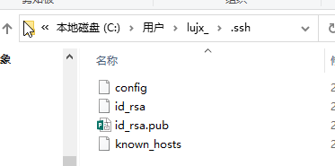
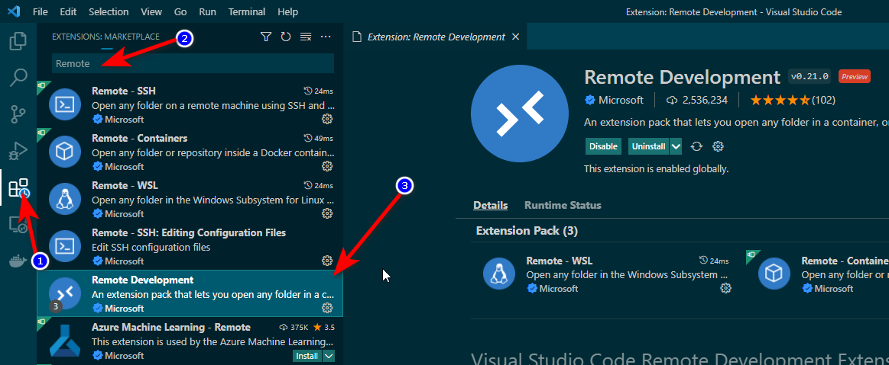
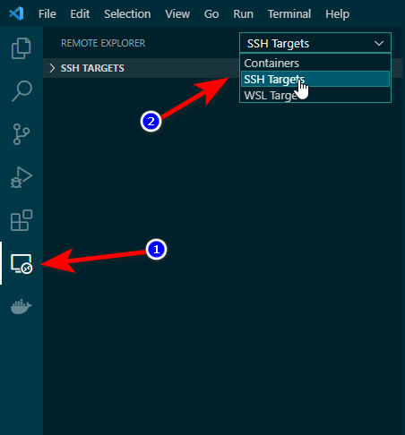
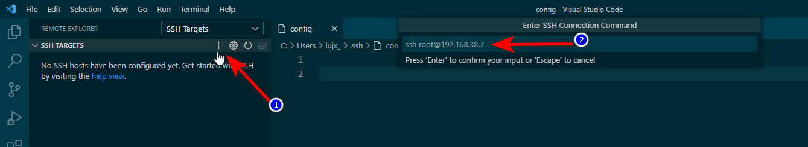
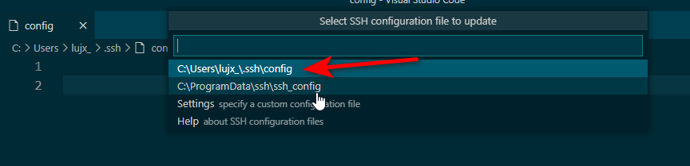
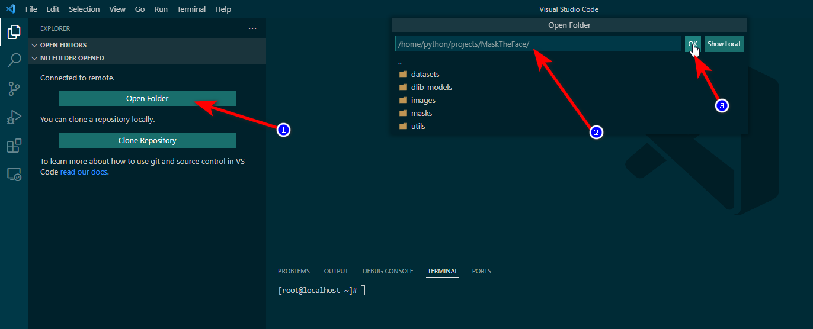
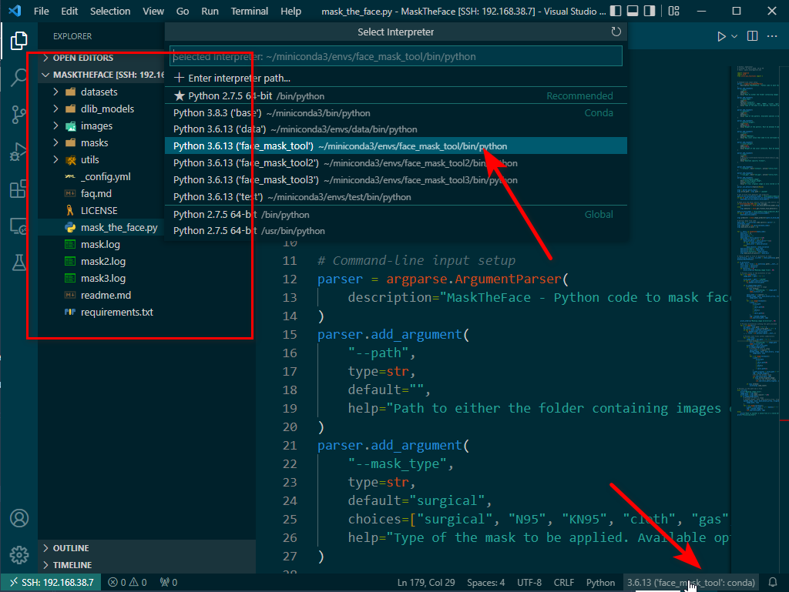

# 概述
vscode微软官方插件`Remote Development`支持远程访问服务器进行代码调试,支持的类型分别是`Container`,`SSH`和`WSL`.这里主要记录一下`本地vscode`添加`远程SSH服务器`主机访问的执行方法.

# 部署方法
## 环境要求
1. 本地安装vscode
2. 本地主机与远程主机可通过SSH方式连接

## 部署远程主机的免密登录

1. 使用本地DOS指令 `ssh-keygen`,输入回车,会在`C:\User\username\.ssh`目录生成一对秘钥`id_rsa`和`id_rsa.pub`
  


2. 添加公钥`id_rsa.pub`到远程主机`/root/.ssh`目录,并重命名文件为`authorized_keys`,若远程主机已添加过其他机器的免密登录,即当前远程主机已有`authorized_keys`文件,则复制公钥`id_rsa.pub`内容,在远程主机的`authorized_keys`文件重起一行粘贴进去.
  


3. 修改文件权限
	```
	chmod 700 /root/.ssh
	chmod 600 /root/.ssh/authorized_keys
	```
4. 测试免密登录
	```
	# 使用指令登录,根据实际环境更换user和remote_ip
	ssh user@remote_ip
	```
> 注: .ssh目录均存放在操作系统的用户家目录. 举例说明,对于本地操作系统是`C:\User\Administrator`,其他用户名需要进行相应的更换; 对于远程Linux主机,` /root/.ssh`, 非root用户则在`/home/not_root_user/.ssh`

## vscode 插件安装与主机连接

1. 安装插件`Remote Development`

    
2. 配置远程主机连接,点击左侧导航栏`Remote Explorer`,选择目标主机类型为`SSH Targets`

	
3. 连接主机地址,点击+,在右侧的地址栏填入ssh连接指令`ssh root@192.168.38.7`,回车确认,选择保存该配置的文件,建议选择`C:\User\administrator\.ssh/config`

	
	
	

4. 打开远程连接窗口
	

5. 在新窗口可以打开项目或工程目录

	
	
6. 如示例所示,此时打开远程Linux主机的`python工程`,同时,可选择`远程python解释器环境`

	

至此,本地vscode调试远程主机代码环境部署完成.


欢迎使用 **{小书匠}(xiaoshujiang)编辑器**，您可以通过 `小书匠主按钮>模板` 里的模板管理来改变新建文章的内容。